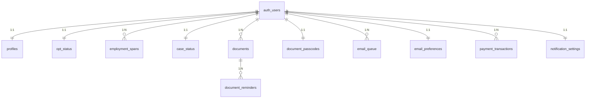
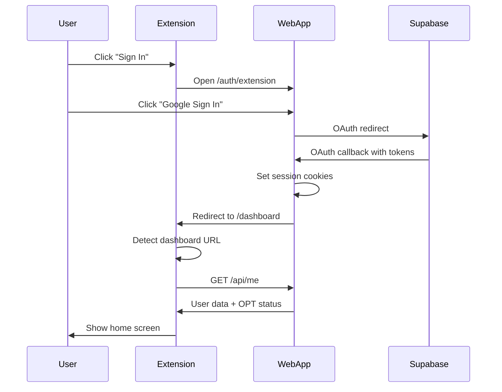

# TrackMyOPT - Complete Project Overview

> **A comprehensive platform for OPT (Optional Practical Training) timeline management**, consisting of a Next.js web application and a Chrome browser extension.

---

## 📚 Table of Contents

- [What is TrackMyOPT?](#what-is-trackmyopt)
- [Architecture Overview](#architecture-overview)
- [Project Structure](#project-structure)
- [Web Application](#web-application-web)
- [Chrome Extension](#chrome-extension-extension)
- [USCIS Case Status API Integration](#uscis-case-status-api-integration)
- [Email Notification System](#email-notification-system)
- [Database Schema](#database-schema)
- [Key Features](#key-features)
- [Authentication Flow](#authentication-flow)
- [API Reference](#api-reference)
- [Tech Stack Summary](#tech-stack-summary)
- [Security & Credentials](#security--credentials)
- [Getting Started](#getting-started)

---

## What is TrackMyOPT?

TrackMyOPT is a **SaaS platform designed specifically for international students and graduates in the United States** who are on F-1 visa status and utilizing Optional Practical Training (OPT) work authorization.

---

### 🎯 The Problem We Solve

**OPT (Optional Practical Training)** is a temporary work authorization that allows F-1 international students to work in the United States for up to 12 months after completing their academic program (or 24 additional months for STEM graduates). However, managing OPT comes with **critical compliance requirements** that, if missed, can result in **loss of legal status and deportation**:

| Challenge | Consequence if Missed |
|-----------|----------------------|
| **90-Day Unemployment Limit** | Exceeding 90 days without employment = automatic visa status violation |
| **60-Day STEM Unemployment Limit** | STEM OPT holders have 60 total unemployment days; exceeding = visa status violation |
| **EAD Card Expiration** | Working after expiration = unauthorized employment |
| **USCIS Filing Deadlines** | Missing deadlines = denial of OPT or STEM extension |
| **Document Expiration** | Expired passport/visa = travel restrictions, RFEs |
| **Address Reporting** | Failure to report = violation of F-1 regulations |

> **The stakes are high**: International students often struggle to track these complex, overlapping deadlines manually. A single missed date can end their ability to work and live in the U.S.

---

### 👥 Who Is This For?

TrackMyOPT serves the following target audiences:

#### 1. **F-1 International Students (Pre-OPT)**
Students in their final semester who are:
- Preparing to apply for OPT
- Need to understand filing windows (90 days before to 60 days after program end)
- Want to track their DSO recommendation date and USCIS deadlines

#### 2. **F-1 Graduates on Post-Completion OPT (Primary Audience)**
Recent graduates who:
- Are currently working on OPT EAD
- Need to track the **90-day unemployment clock** (most critical feature)
- Want reminders for EAD expiration
- Need to monitor their USCIS case status

#### 3. **STEM OPT Extension Holders**
Graduates with STEM degrees who:
- Have received a 24-month STEM OPT extension
- Need to track the **60-day unemployment limit** (60 STEM days)
- Have additional reporting requirements
- Need to ensure their I-983 training plan is valid

#### 4. **International Student Advisors (DSOs)**
Designated School Officials who:
- Advise students on OPT processes
- May recommend the tool to students
- Need to ensure students understand deadlines

---

### 🌍 Context: Why OPT Tracking Matters

**The Numbers:**
- ~1.1–1.2 million international students in the U.S. (2023)
- ~200,000+ OPT applications filed annually
- OPT is the **#1 pathway** for international talent to work in the U.S. before H-1B sponsorship

**The Pain Points:**
1. **Complex Calculations**: Filing windows depend on program end date, DSO recommendation date, and USCIS processing times
2. **No Official USCIS Tool**: USCIS provides no real-time tracking or countdown features
3. **Manual Tracking**: Most students use spreadsheets, calendar reminders, or nothing at all
4. **High Anxiety**: The consequences of errors are severe—students live in constant worry
5. **Scattered Documents**: Immigration documents are stored in emails, Google Drive, phone photos

---

### 💡 How TrackMyOPT Helps

| Feature | Problem Solved |
|---------|---------------|
| **OPT Countdown Dashboard** | Visualize days remaining until deadlines; no more manual calculations |
| **90/60-Day Unemployment Clock** | Real-time tracking with visual warnings at 60, 75, 85 days |
| **USCIS Case Status Checker** | Automatic status monitoring with email alerts on changes |
| **Document Vault** | Secure, organized storage with AI-powered expiry detection |
| **Email Reminders** | Proactive notifications before critical deadlines |
| **Chrome Extension** | Quick access to countdown without opening the full app |
| **STEM-Specific Tools** | Separate calculators for STEM extension timelines |

---

### 📋 Core Features Explained

1. **Track OPT Timeline** - Monitor critical OPT dates including program end, EAD expiration, STEM extension dates
2. **Calculate Unemployment Days** - Track the 90-day unemployment limit (or 60 days for STEM OPT) with real-time countdown
3. **USCIS Case Status Tracking** - Monitor case status updates with optional email notifications when status changes
4. **Document Vault** - Securely store and manage important immigration documents (I-20, EAD, Passport, Visa) with AI-powered analysis that auto-detects expiry dates
5. **Deadline Reminders** - Get email notifications 6 months, 3 months, 1 month, and 7 days before important dates

---

## Architecture Overview

```
┌─────────────────────────────────────────────────────────────────────────────┐
│                              TrackMyOPT Platform                             │
├─────────────────────────────────────────────────────────────────────────────┤
│                                                                             │
│  ┌─────────────────────────┐         ┌─────────────────────────┐           │
│  │   Chrome Extension      │◄───────►│      Web Application     │           │
│  │   (Manifest V3)         │   API   │      (Next.js 14)        │           │
│  │                         │         │                          │           │
│  │  • OPT Countdown        │         │  • Dashboard             │           │
│  │  • Clock Tracker        │         │  • Document Vault        │           │
│  │  • STEM Tools           │         │  • Case Status           │           │
│  │  • Quick Access         │         │  • Settings              │           │
│  └─────────────────────────┘         └───────────┬──────────────┘           │
│                                                  │                          │
│                                                  ▼                          │
│                              ┌───────────────────────────────┐              │
│                              │        Supabase                │              │
│                              │  • PostgreSQL Database         │              │
│                              │  • Authentication (OAuth)      │              │
│                              │  • Row Level Security          │              │
│                              └───────────────────────────────┘              │
│                                                                             │
│  ┌─────────────────────────┐         ┌─────────────────────────┐           │
│  │   External Services      │         │   Storage Services       │           │
│  │  • Stripe (Payments)     │         │  • AWS S3 (Documents)    │           │
│  │  • Nodemailer (Emails)   │         │  • AI Analysis (Gemini)  │           │
│  │  • USCIS API (Cases)     │         │  • Virus Scanning        │           │
│  │  • cron-job.org (Cron)   │         │                          │           │
│  └─────────────────────────┘         └─────────────────────────┘           │
│                                                                             │
└─────────────────────────────────────────────────────────────────────────────┘
```

---

## Project Structure

```
TrackMyOPT/
├── web/                         # Next.js 14 Web Application
│   ├── app/                     # App Router (pages & API routes)
│   │   ├── api/                 # 17+ API route groups
│   │   │   ├── case-status/     # USCIS case tracking APIs
│   │   │   │   ├── route.ts     # Save/get receipt number
│   │   │   │   ├── check/       # Fetch status from USCIS
│   │   │   │   ├── notify/      # Send status change emails
│   │   │   │   └── refresh/     # Manual refresh
│   │   │   ├── cron/            # Cron job endpoints
│   │   │   │   ├── check-case-status/ # 6-hour case checks
│   │   │   │   └── daily-reminders/   # Daily email reminders
│   │   │   └── user/            # User settings
│   │   │       └── notification-email/ # Email preferences
│   │   ├── auth/                # Authentication pages
│   │   ├── dashboard/           # Dashboard pages
│   │   │   └── case-status/     # USCIS case tracker page
│   │   ├── premium/             # Premium features
│   │   └── page.tsx             # Landing page
│   ├── components/              # React components
│   │   ├── dashboard/           # 35+ dashboard components
│   │   │   ├── CaseStatusSection.tsx      # Main case tracker UI
│   │   │   ├── CaseProgressStepper.tsx    # 5-step progress visual
│   │   │   ├── CaseHistoryTimeline.tsx    # Collapsible timeline
│   │   │   └── ...
│   │   ├── ui/                  # Reusable UI components
│   │   └── opt-tools/           # OPT-specific components
│   ├── lib/                     # Utility libraries
│   │   ├── optCalculations.ts   # OPT date & unemployment calculations
│   │   ├── supabaseClient.ts    # Supabase client
│   │   ├── jwt.ts               # JWT token handling
│   │   ├── email-service.ts     # Email notifications (Nodemailer)
│   │   ├── s3.ts                # AWS S3 integration
│   │   ├── gemini-ai.ts         # AI document analysis
│   │   └── uscis-checker.ts     # USCIS Case Status API integration
│   ├── supabase/                # Database configuration
│   │   ├── schema/              # 8 SQL schema files
│   │   └── migrations/          # Database migrations
│   └── middleware.ts            # Auth middleware
│
├── extension/                   # Chrome Extension (Manifest V3)
│   ├── src/
│   │   ├── popup.ts             # Extension popup entry point
│   │   ├── background.ts        # Service worker (auth, messaging)
│   │   ├── home.ts              # Home view renderer
│   │   ├── locked.ts            # Locked state view
│   │   ├── navigation.ts        # Page navigation
│   │   └── pages/               # 8 tool pages
│   ├── manifest.json            # Chrome extension manifest
│   └── public/icons/            # Extension icons
│
├── package.json                 # Root workspace config
└── pnpm-workspace.yaml          # pnpm workspace definition
```

---

## Web Application (`web/`)

### Pages & Routes

| Route | Description |
|-------|-------------|
| `/` | Marketing landing page with features & pricing |
| `/login` | User login page |
| `/auth/callback` | OAuth callback handler |
| `/auth/extension` | Authentication for Chrome extension |
| `/auth/reset-password` | Password reset flow |
| `/dashboard` | Main user dashboard |
| `/dashboard/opt-dates` | OPT dates management |
| `/dashboard/case-status` | **USCIS case tracking** |
| `/dashboard/documents` | Document vault |
| `/dashboard/opt-tools` | OPT calculation tools |
| `/dashboard/tax-filing` | Tax filing assistance |
| `/dashboard/opt-health-insurance-finder` | Health insurance finder |
| `/dashboard/settings` | User settings & preferences |
| `/dashboard/help` | Help & support |
| `/premium` | Premium upgrade page |
| `/privacy` | Privacy policy |
| `/terms` | Terms of service |

### API Routes (17+ Groups)

| API Group | Endpoints | Purpose |
|-----------|-----------|---------|
| `/api/auth` | Google OAuth, session management | Authentication |
| `/api/me` | Get current user profile & OPT status | User data |
| `/api/opt` | OPT dates CRUD operations | OPT management |
| `/api/employment` | Employment spans management | Unemployment tracking |
| `/api/case-status` | **USCIS case tracking (4 endpoints)** | Case monitoring |
| `/api/documents` | Upload, download, delete documents | Document vault |
| `/api/email` | Email sending & verification | Notifications |
| `/api/premium` | Stripe checkout & webhooks | Payments |
| `/api/user` | User profile updates | Profile management |
| `/api/cron` | **Automated tasks (case checks, reminders)** | Automation |
| `/api/extension` | Extension-specific endpoints | Chrome extension |

### Key Components

#### Dashboard Components (`components/dashboard/`)

| Component | Description |
|-----------|-------------|
| `OptDatesSection.tsx` | Display & edit OPT dates |
| `CaseStatusSection.tsx` | **USCIS case status with progress stepper, timeline, smart validation** |
| `CaseProgressStepper.tsx` | **5-step visual progress (Received → Card Produced)** |
| `CaseHistoryTimeline.tsx` | **Collapsible case history with "View Full History" toggle** |
| `DocumentVaultClient.tsx` | Document management interface |
| `UnemploymentTracker.tsx` | 90/150 day unemployment counter |
| `SettingsSection.tsx` | Comprehensive settings panel |
| `UpcomingDeadlinesPanel.tsx` | Deadline notifications |
| `PersonalizedTips.tsx` | AI-generated tips |
| `MetricCards.tsx` | Dashboard stats cards |

---

## USCIS Case Status API Integration

### Overview

The application integrates with the **official USCIS Case Status API** to provide automatic case tracking.

### API Details

| Property | Value |
|----------|-------|
| **API Provider** | USCIS (U.S. Citizenship and Immigration Services) |
| **Authentication** | OAuth 2.0 Client Credentials |
| **Sandbox URL** | `https://api-int.uscis.gov/case-status` |
| **Production URL** | `https://api.uscis.gov/case-status` |
| **Demo ID Header** | `demo_id: 3333` (required for sandbox) |

### Sandbox Limitations

| Limitation | Details |
|------------|---------|
| **Operating Hours** | Monday - Friday, 7:00 AM - 8:00 PM EST |
| **Receipt Numbers** | Only staging/test numbers work |
| **Rate Limits** | 5 TPS, 1,000 requests/day |

### Valid Staging Receipt Numbers

| Receipt Number | Status |
|----------------|--------|
| `EAC9999103403` | Approved case |
| `SRC9999102777` | Active case |
| `LIN9999106498` | Pending case |

### Key Files

| File | Purpose |
|------|---------|
| `web/lib/uscis-checker.ts` | OAuth token management, API calls, error handling |
| `web/app/api/case-status/route.ts` | Save receipt number to database |
| `web/app/api/case-status/check/route.ts` | Fetch status from USCIS API |
| `web/app/api/case-status/notify/route.ts` | Send email when status changes |
| `web/app/api/cron/check-case-status/route.ts` | 6-hour automated checks |

### Error Handling (4xx/5xx)

The application implements comprehensive error handling for all USCIS API responses:

| Error Code | Meaning | User Message |
|------------|---------|--------------|
| **401** | Invalid/expired token | "🔐 Unauthorized: Your session has expired" |
| **404** | Receipt not found | "🔍 Receipt Not Found: Not valid in Sandbox mode" |
| **422** | Invalid format | "⚠️ Invalid Format: Must be 13 characters" |
| **429** | Rate limit exceeded | "⏱️ Rate Limit: Too many requests" |
| **503** | Service unavailable | "🔴 Sandbox is offline (Mon-Fri 7AM-8PM EST)" |

### Data Flow

```
User enters receipt → Save to DB → Trigger USCIS API call
                                        ↓
                              Get OAuth access token
                                        ↓
                              GET /case-status/{receipt}
                                        ↓
                              Parse response, store history
                                        ↓
                              If status changed → Send email
```

---

## Email Notification System

### Email Service (`web/lib/email-service.ts`)

The application uses **Nodemailer with SMTP** for sending emails.

### Email Types

| Email Type | Trigger | Content |
|------------|---------|---------|
| **Enrollment Email** | User saves notification email | Welcome message for tool type |
| **Case Status Change** | USCIS status changes | Old status → New status |
| **Document Expiry Reminder** | Document approaching expiry | Reminder at 60, 45, 30, 20, 10, 5, 0 days |
| **Daily OPT Reminder** | Daily cron at 9 AM ET | OPT timeline status |

### Tool-Specific Enrollment Emails

| Tool Type | Email Title |
|-----------|-------------|
| `case-status` | "Welcome to Case Status Tracker" |
| `documents` | "Welcome to Document Expiry Reminders" |
| `opt-apply` | "Welcome to OPT Apply Dates" |

### Email Flow

```
User enables notifications → Save email to profiles table
                                    ↓
                          Send enrollment email (tool-specific)
                                    ↓
                          On status change → Send alert email
```

---

## Automated Jobs (Cron)

### External Cron Service: cron-job.org

| Job | Frequency | Endpoint |
|-----|-----------|----------|
| **Case Status Check** | Every 6 hours | `GET /api/cron/check-case-status` |
| **Daily Reminders** | Daily 9 AM ET | `GET /api/cron/daily-reminders` |

### Security

Cron endpoints are protected by `CRON_SECRET` environment variable:
```
Authorization: Bearer {CRON_SECRET}
```

---

## Chrome Extension (`extension/`)

### How It Works

1. **Authentication**: Extension opens web app login page, user authenticates via Google OAuth or manual login
2. **Session Sharing**: After login, session is shared with extension via cookies
3. **API Access**: Extension calls web app APIs to fetch/display OPT data
4. **Offline Support**: Some data cached in `chrome.storage.sync`

### Extension Pages

| Page | File | Purpose |
|------|------|---------|
| Home | `home.ts` | Main dashboard view |
| Locked | `locked.ts` | Sign-in required view |
| OPT Apply | `opt-apply.ts` | Calculate OPT application dates |
| OPT Countdown | `opt-countdown.ts` | Display countdown to deadlines |
| Clock | `clock.ts` | Input start date for unemployment |
| Clock Tracker | `clock-tracker.ts` | Track 90-day unemployment |
| STEM Apply | `stem-apply.ts` | STEM extension dates |
| STEM Countdown | `stem-countdown.ts` | STEM extension countdown |
| STEM Clock | `stem-clock.ts` | STEM unemployment input |
| STEM Clock Tracker | `stem-clock-tracker.ts` | Track 150-day STEM unemployment |

### Manifest Permissions

```json
{
  "permissions": ["identity", "storage", "tabs", "alarms", "notifications", "scripting"],
  "host_permissions": ["https://www.trackmyopt.com/*", "https://trackmyopt.com/*"]
}
```

---

## Database Schema

### Tables Overview (12 Total)



### Table Details

| Table | Purpose | Key Fields |
|-------|---------|------------|
| `profiles` | User profile & preferences | `email`, `timezone`, `premium_status`, `stripe_customer_id`, `notification_email` |
| `opt_status` | OPT timeline dates | `program_end_date`, `opt_start_date`, `opt_ead_end_date`, `stem_start_date` |
| `employment_spans` | Employment history | `employer_name`, `start_date`, `end_date` |
| `case_status` | **USCIS case tracking** | `receipt_number`, `current_status`, `status_history`, `last_checked_at`, `notifications_enabled` |
| `documents` | Document metadata | `file_name`, `document_type`, `s3_key`, `extracted_fields`, `expiry_date` |
| `document_passcodes` | Vault passcodes | `passcode_hash`, `failed_attempts`, `locked_until` |
| `document_reminders` | Expiry reminders | `reminder_type`, `send_at`, `status` |
| `email_preferences` | Email settings | `email_address`, `email_verified`, `email_enabled` |
| `email_queue` | Email history | `email_type`, `status`, `sent_at` |
| `payment_transactions` | Payment records | `stripe_payment_intent_id`, `amount`, `status` |
| `blocked_emails` | Blocked addresses | `email`, `reason` |
| `notification_settings` | Notification prefs | `email_notifications`, `push_notifications` |

### Case Status Table Schema

```sql
CREATE TABLE case_status (
  id UUID PRIMARY KEY DEFAULT gen_random_uuid(),
  user_id UUID REFERENCES auth.users(id),
  receipt_number VARCHAR(13) UNIQUE NOT NULL,
  current_status TEXT,
  case_type TEXT,
  received_date TIMESTAMPTZ,
  last_checked_at TIMESTAMPTZ,
  last_status_change_at TIMESTAMPTZ,
  status_history JSONB DEFAULT '[]',
  notifications_enabled BOOLEAN DEFAULT true,
  created_at TIMESTAMPTZ DEFAULT NOW(),
  updated_at TIMESTAMPTZ DEFAULT NOW()
);
```

---

## Key Features

### Free Features
- ✅ OPT dates tracking & countdown
- ✅ 90-day unemployment clock
- ✅ Basic deadline reminders
- ✅ Chrome extension access
- ✅ USCIS case status checking

### Premium Features ($2.99 one-time)
- 🔒 Document Vault with AI analysis
- 🔒 Automatic document expiry reminders
- 🔒 Advanced email notifications
- 🔒 Priority support

---

## Authentication Flow



---

## API Reference

### Case Status Endpoints

#### `GET /api/case-status`
Get current user's case status.

**Response:**
```json
{
  "ok": true,
  "data": {
    "receipt_number": "EAC9999103403",
    "current_status": "Case Was Approved",
    "case_type": "I-765",
    "last_checked_at": "2026-01-08T10:30:00Z",
    "status_history": [
      { "status": "Case Was Approved", "date": "12-05-2025" },
      { "status": "Case Was Received", "date": "10-15-2025" }
    ]
  }
}
```

#### `POST /api/case-status`
Save receipt number and trigger status check.

**Body:**
```json
{
  "receipt_number": "EAC9999103403",
  "notifications_enabled": true
}
```

#### `POST /api/case-status/check`
Fetch status from USCIS API (internal use).

**Headers:**
```
X-Internal-Request: true
```

**Body:**
```json
{
  "receipt_number": "EAC9999103403"
}
```

**Response (Success):**
```json
{
  "ok": true,
  "data": {
    "receipt_number": "EAC9999103403",
    "status": "Case Was Approved",
    "changed": true,
    "isFirstCheck": false
  }
}
```

**Response (Error):**
```json
{
  "ok": false,
  "error": "🔍 Receipt Not Found (404): Not valid in Sandbox mode",
  "errorCode": 404,
  "errorDetails": "Sandbox mode only accepts staging receipt numbers"
}
```

#### `GET /api/cron/check-case-status`
Cron job endpoint for 6-hour automated checks.

**Headers:**
```
Authorization: Bearer {CRON_SECRET}
```

---

## Tech Stack Summary

### Web Application
| Technology | Purpose |
|------------|---------|
| **Next.js 14** | React framework with App Router |
| **TypeScript** | Type safety |
| **Tailwind CSS** | Styling |
| **Supabase** | PostgreSQL + Auth + RLS |
| **Stripe** | Payment processing |
| **AWS S3** | Document storage |
| **Nodemailer** | Email delivery (SMTP) |
| **Google Gemini** | AI document analysis |
| **jose** | JWT handling |
| **Zod** | Validation |

### Chrome Extension
| Technology | Purpose |
|------------|---------|
| **Manifest V3** | Chrome extension standard |
| **TypeScript** | Type safety |
| **esbuild** | Bundling |
| **Chrome APIs** | Storage, notifications, alarms |

### External Services
| Service | Purpose |
|---------|---------|
| **USCIS API** | Case status checking |
| **cron-job.org** | Scheduled job execution |
| **Vercel** | Hosting & deployment |

---

## Security & Credentials

### Environment Variables (Server-Side Only)

All sensitive credentials are stored as **environment variables on Vercel**, never in code:

| Variable | Description | Storage Location |
|----------|-------------|------------------|
| `NEXT_PUBLIC_SUPABASE_URL` | Supabase project URL | Vercel env vars |
| `NEXT_PUBLIC_SUPABASE_ANON_KEY` | Supabase anonymous key | Vercel env vars |
| `SUPABASE_SERVICE_ROLE_KEY` | Supabase service role key | Vercel env vars |
| `USCIS_CLIENT_ID` | USCIS API client ID | Vercel env vars |
| `USCIS_CLIENT_SECRET` | USCIS API client secret | Vercel env vars |
| `USCIS_TOKEN_URL` | USCIS OAuth token endpoint | Vercel env vars |
| `USCIS_API_BASE_URL` | USCIS API base URL | Vercel env vars |
| `CRON_SECRET` | Secret for cron job auth | Vercel env vars |
| `SMTP_HOST` | Email SMTP host | Vercel env vars |
| `SMTP_PORT` | Email SMTP port | Vercel env vars |
| `SMTP_USER` | Email SMTP username | Vercel env vars |
| `SMTP_PASS` | Email SMTP password | Vercel env vars |
| `JWT_SIGNING_SECRET` | Secret for JWT signing | Vercel env vars |
| `STRIPE_SECRET_KEY` | Stripe secret key | Vercel env vars |
| `STRIPE_WEBHOOK_SECRET` | Stripe webhook secret | Vercel env vars |
| `AWS_ACCESS_KEY_ID` | AWS S3 access key | Vercel env vars |
| `AWS_SECRET_ACCESS_KEY` | AWS S3 secret key | Vercel env vars |
| `AWS_S3_BUCKET` | S3 bucket name | Vercel env vars |
| `GEMINI_API_KEY` | Google Gemini AI key | Vercel env vars |

### Security Practices

1. **Client credentials stored server-side only** - Never exposed to browser
2. **API routes use service role key** - Not the anon key for database writes
3. **CRON_SECRET protects cron endpoints** - External services must authenticate
4. **X-Internal-Request header** - Marks internal API calls
5. **Row Level Security (RLS)** - Database enforces user isolation

---

## Getting Started

### Prerequisites
- Node.js 18+
- pnpm (`npm install -g pnpm`)
- Supabase account
- Stripe account (for payments)
- AWS S3 bucket (for documents)

### Quick Start

```bash
# 1. Clone and install
git clone <repo-url>
cd TrackMyOPT
pnpm install

# 2. Setup environment
cd web
cp .env.local.example .env.local
# Edit .env.local with your credentials

# 3. Run database migrations in Supabase SQL Editor
# (Execute files in supabase/schema/ in order: 000 → 007)

# 4. Start development
pnpm dev:web     # Web app at http://localhost:3000
pnpm dev:ext     # Extension builds to extension/dist/

# 5. Load extension in Chrome
# chrome://extensions → Developer Mode → Load Unpacked → select extension/dist/
```

---

## OPT Calculation Logic

### Key Dates Explained

| Date | Formula | Purpose |
|------|---------|---------|
| **Earliest File Date** | `program_end_date - 90 days` | Earliest date to file OPT |
| **Latest File Date** | `program_end_date + 60 days` | Deadline to file OPT |
| **Must Arrive By** | `min(program_end + 60, dso_rec + 30)` | Latest EAD arrival date |
| **OPT Start Window** | `program_end_date → program_end + 60` | Valid OPT start dates |

### Unemployment Tracking

- **Regular OPT**: Maximum 90 days unemployed
- **STEM OPT**: Additional 60 days (60 days total)
- **Calculation**: Total days - Employed days = Unemployed days

---

## Case Status Progress Mapping

The `CaseProgressStepper` component maps USCIS statuses to 5 lifecycle steps:

| Step | Name | USCIS Statuses |
|------|------|----------------|
| 1 | **Received** | "Case Was Received", "Fee Was Accepted" |
| 2 | **Biometrics** | "Fingerprints", "Biometric", "Appointment" |
| 3 | **Active Review** | "Being Reviewed", "Under Review", "RFE" |
| 4 | **Decision** | "Was Approved", "Was Denied" |
| 5 | **Card Produced** | "Card Was Mailed", "Card Was Produced", "Card Was Delivered" |

---

## Recent Updates (January 2026)

1. **4xx Error Handling** - Comprehensive error handling for all USCIS API errors with user-friendly messages
2. **Case Progress Stepper** - Visual 5-step progress indicator
3. **Collapsible Timeline** - "View Full History" toggle for case history
4. **Smart Input Validation** - Inline warnings for real receipts in sandbox mode
5. **Compact Sandbox Notice** - Minimized collapsible banner
6. **Tool-Specific Enrollment Emails** - Different email templates for each tool type

---

## Support

For questions or issues:
- Email: support@trackmyopt.com
- Dashboard: `/dashboard/help`

---

*Last Updated: January 2026*
