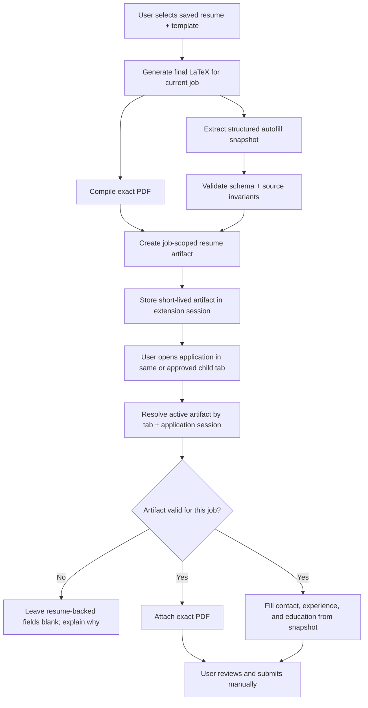

# Job-Scoped Generated Resume Autofill

> Status: architecture decision and phased implementation plan  
> Date: 2026-07-16  
> Scope: the injected extension widget, custom-resume generation, PDF attachment,
> and application-field prefill on ATS pages such as Workday, Greenhouse, Lever,
> LinkedIn Easy Apply, Ashby, and iCIMS.

## Executive decision

Yes, this is possible in the current TrackMyOPT architecture, but the full
behavior is **not implemented yet**.

The current code already does one useful part correctly: after a custom resume
is generated in the widget, that exact PDF is held in memory for the current
job and is passed to the prefill engine for attachment. It does **not**, however,
use the generated resume as the source for company names, job titles, employment
dates, education, or experience descriptions. Those fields are not represented
in the current extension autofill contract at all.

The production implementation should introduce a **job-scoped generated resume
artifact** containing:

1. The exact generated PDF.
2. A validated structured snapshot of the exact generated resume.
3. The selected base-resume ID and generated-content hash.
4. The job/application identity to which it belongs.
5. A short-lived application-session binding.

When the user clicks **Prefill application**, the extension must resolve that
artifact explicitly. Resume-backed fields must come from the artifact or remain
blank. They must never silently fall back to a different saved resume or a
previously generated resume.

## Product requirement in one sentence

> Prefill the open application with the PDF and resume-backed values from the
> custom resume the user generated for this job, and never from another resume.

## What works today and what does not

| Capability | Current status | Evidence |
|---|---:|---|
| Generate a custom resume from a user-selected saved resume | Yes | `generateTailoredResume()` in `apps/extension/src/background.ts` |
| Compile and return the exact generated PDF | Yes | `generateTailoredResume()` returns `pdfBase64` |
| Bind the generated PDF to a job in the current document | Yes, narrowly | `generatedResumeForCurrentJob` and `jobFingerprint()` in `content-job-portal.ts` |
| Attach that PDF to an empty Resume/CV file input | Yes, where the ATS permits it | `attachGeneratedResume()` in `easy-apply-engine.ts` |
| Fill name, email, phone, location, years of experience, and profile URLs | Yes | `AutofillProfile`, `valueForKind()`, and `GET_AUTOFILL_PROFILE` |
| Fill company, title, employment dates, or experience descriptions | No | No work-history types or mappings exist |
| Fill education from the generated resume | No | No education types or mappings exist |
| Preserve the generated resume across page reloads or ATS route changes | No | The PDF is intentionally stored only in a module-level variable |
| Carry the generated resume when Apply opens a new tab | No | There is no tab/application-session artifact registry |
| Guarantee that resume text fields and attached PDF are the same version | No | Only the PDF is carried into prefill; no generated structured snapshot exists |

## Current implementation trace

### 1. Generation

The widget sends `GENERATE_RESUME` to the extension background worker. The
background worker:

1. Loads the explicitly selected saved resume.
2. Calls `/api/resume-generator/generate` to create tailored LaTeX.
3. Compiles that LaTeX into a PDF.
4. Optionally repairs invalid LaTeX and compiles again.
5. Scores the final LaTeX.
6. Creates an editor handoff.
7. Returns the PDF as base64 to the content script.

This is a good foundation because generation starts from an explicit
`resumeId`; it is not blindly using a random historical resume.

### 2. Job scoping

After generation, `renderResumeResult()` assigns:

```ts
generatedResumeForCurrentJob = {
  jobFingerprint: jobFingerprint(job),
  pdfBase64,
  filename,
};
```

`generatedResumeFor(job)` returns the PDF only when the current fingerprint
matches. This prevents obvious same-document reuse on another posting.

The weakness is lifecycle, not intent. The value is a module-level variable,
so it disappears when the content script is recreated. The fingerprint also
contains the current URL, which commonly changes between a job listing and a
Workday application step.

### 3. PDF attachment

The widget passes the current PDF into both the top-frame prefill engine and the
child-frame relay:

```ts
chrome.runtime.sendMessage({ type: 'PREFILL_CHILD_FRAMES', resume });
const result = await runPrefill({ resume });
```

`attachGeneratedResume()` converts base64 to a `File`, finds an empty file
input confidently labeled Resume/CV, uses `DataTransfer`, and dispatches input
and change events. It refuses to overwrite an existing file and refuses fields
labeled for a cover letter, photo, transcript, or another document type.

That behavior should be retained.

### 4. Text-field source

`runPrefill()` separately sends `GET_AUTOFILL_PROFILE`. The returned type has
only:

```ts
firstName
lastName
fullName
email
phone
city
state
yearsExperience
linkedinUrl
portfolioUrl
```

The values come from `/api/me` and `application_profile`, not from the newly
generated resume.

The classifier reinforces this limitation. `FieldKind` has no employer, job
title, date, work-description, education, or skill field types. In addition,
`ORG_TRAP_RE` intentionally rejects labels containing company, employer,
school, university, or manager because those labels are unsafe without section
context.

This means a field labeled **Company** is currently skipped by design.

### 5. Existing database data is not enough

The `resumes` table has a `structured_data` JSON column, but it is not a usable
canonical resume model today:

- Newly uploaded base resumes are saved with `structuredData: {}`.
- Generated resumes store editor metadata such as LaTeX, job description, ATS
  score, and template ID, not normalized employment and education records.
- `/api/resume-generator/base-resume` currently returns only `id`, `filename`,
  `content`, and `updated_at`.
- The in-widget generated resume is not saved as a new `resumes` row; it is
  returned as a PDF and optionally placed into a short-lived editor handoff.

The existing column can later hold a versioned `autofillSnapshot`, but it should
not be treated as populated or trustworthy without validation.

## Why a PDF-only solution is insufficient

An application form cannot reliably derive work history from a PDF in the
browser. ATS systems expose individual fields such as:

- Employer
- Job title
- Location
- Start month/year
- End month/year
- Currently employed
- Role description
- School
- Degree and field of study

The extension needs structured values before it touches the DOM. Parsing the
PDF at click time would be slow, template-dependent, difficult to validate, and
could produce data that does not exactly match the generated version.

The correct boundary is the resume-generation pipeline: create and validate a
structured snapshot from the final generated content, then keep that snapshot
and the compiled PDF together as one artifact.

## Required source-of-truth rules

These rules are the core of the feature and should be tested as invariants.

### Rule 1 — generated artifact first

For resume-backed fields, use only the active artifact generated for the
current application session.

### Rule 2 — no historical-resume fallback

If the artifact is missing, expired, belongs to another job, or fails schema
validation, leave work history and education blank. Do not query “latest
resume,” the last opened resume, or any other saved resume.

### Rule 3 — limited profile fallback

The account/application profile may fill only missing basic contact fields:

- name
- email
- phone
- city/state
- LinkedIn
- portfolio

It must not supply employer, role, dates, descriptions, education, projects, or
skills for an artifact-backed application.

For the strictest interpretation of “everything from this resume,” even contact
fields should prefer the artifact and use the profile only when the artifact
does not contain the value.

### Rule 4 — never use OPT employment spans as resume history

`employment_spans` exists for OPT/unemployment-clock calculations. It is not a
resume source and may be incomplete or intentionally different from a resume.
It must not be merged into application work history.

### Rule 5 — never overwrite the applicant

Retain the current invariant: any non-empty field or existing uploaded file is
left unchanged.

### Rule 6 — sensitive answers remain manual

Never store or fill work authorization, visa/sponsorship, citizenship, EEO,
demographic data, salary, date of birth, SSN, disability, or veteran answers.

### Rule 7 — no silent “Add another” automation in the first release

The current engine never clicks buttons. The first implementation should fill
only experience/education rows that are already visible. If more records are
available, show:

> 2 more experience entries are ready. Add another row, then click Prefill
> again.

Automating ATS **Add another** buttons would change a deliberate product and
compliance invariant and should be reviewed separately.

## Important truthfulness prerequisite

Before work-history autofill is enabled, review the resume-generation prompt.
The current prompt explicitly allows aggressive job-title rewriting while also
requiring company names and dates to remain unchanged.

Automatically copying a rewritten title into an employer application raises
the risk of submitting a title that was optimized rather than verified. The
recommended rule is:

- Preserve official company names, official job titles, schools, degrees, and
  employment/education dates.
- Tailor summaries, skills ordering, and truthful bullets.
- If title normalization remains a product requirement, show the generated
  title in a review screen and require explicit confirmation before it becomes
  eligible for application autofill.

The attached resume and the populated application must not disagree, but
agreement alone is not enough; the shared data must also be user-verified.

## Target architecture



### Artifact contract

The exact contract can evolve, but it must be versioned from day one.

```ts
interface GeneratedResumeArtifactV1 {
  schemaVersion: 1;
  artifactId: string;
  sourceResumeId: string;
  sourceResumeFilename: string;
  templateId: string;
  job: {
    jobKey: string;
    companyName: string;
    roleTitle: string;
    sourceUrl: string;
    requisitionId?: string;
  };
  generatedAt: string;
  expiresAt: string;
  generatedContentHash: string;
  pdf: {
    filename: string;
    base64: string;
    sha256: string;
  };
  snapshot: ResumeAutofillSnapshotV1;
}

interface ResumeAutofillSnapshotV1 {
  contact: {
    firstName?: string;
    lastName?: string;
    fullName?: string;
    email?: string;
    phone?: string;
    city?: string;
    state?: string;
    country?: string;
    linkedinUrl?: string;
    portfolioUrl?: string;
  };
  summary?: string;
  totalYearsExperience?: number;
  skills: string[];
  experience: Array<{
    company: string;
    title: string;
    location?: string;
    startDate: ResumeDateValue;
    endDate?: ResumeDateValue;
    isCurrent: boolean;
    bullets: string[];
    descriptionText: string;
  }>;
  education: Array<{
    school: string;
    degree?: string;
    fieldOfStudy?: string;
    location?: string;
    startDate?: ResumeDateValue;
    endDate?: ResumeDateValue;
  }>;
  certifications: Array<{
    name: string;
    issuer?: string;
    issuedDate?: ResumeDateValue;
  }>;
}

interface ResumeDateValue {
  originalText: string;
  year?: number;
  month?: number;
  precision: 'month' | 'year' | 'text';
}
```

Keep `originalText` so the user can see exactly what appeared on the generated
resume. Use normalized month/year values only when a matching ATS control
requires them. Never invent a missing month.

### Artifact identity

`jobKey` should not be the full current URL alone. It should prefer, in order:

1. ATS requisition/job ID when confidently extracted.
2. Canonical job URL plus normalized company and role.
3. Normalized company and role plus the source-listing tab/application session.

The background worker should own the application-session binding because it
can see `sender.tab.id`. The content script should not decide that an unrelated
resume is “close enough.”

### Session lifecycle

Recommended lifecycle:

- **Generate:** create an artifact and bind it to the current tab.
- **Same-tab navigation:** retain the binding even when the ATS changes the URL.
- **New tab opened by Apply:** detect the opener relationship, then show a
  one-time confirmation such as “Use the resume generated for Software
  Engineer at Acme?” before binding the new tab.
- **Generate again:** replace the active artifact for that tab only.
- **Different detected job:** suspend the artifact and require confirmation or
  regeneration; never silently reassign it.
- **Tab closed, sign-out, expiration, extension update, or browser restart:**
  delete the binding and artifact.
- **User selects Edit:** either invalidate the current artifact or update it only
  after the edited LaTeX is recompiled and a new snapshot is validated.

Use `chrome.storage.session` for short-lived metadata and structured data. It is
in-memory, is cleared on browser restart/extension reload, and is not exposed to
content scripts by default. Chrome documents a 10 MB session quota, so the
implementation must measure payload size and cap the PDF. A practical first
release can keep only one active artifact per tab and reject session persistence
for unusually large PDFs while still allowing immediate same-page attachment.

Do not use `chrome.storage.sync` for resume data.

## Structured snapshot generation

### Recommended first implementation

Build the snapshot from the **final LaTeX after any repair**, not from the base
resume and not from the initial model response. This guarantees that the
snapshot corresponds to the PDF that actually compiled.

The current templates use multiple structures (`\resumeSubheading` in several
templates and `\subsection`/`\subtext` in others), so one large regular
expression will be brittle. Use a layered pipeline:

1. Convert final LaTeX to normalized plain text with the existing
   `apps/web/lib/resume/latex-to-plain-text.ts` utilities.
2. Extract a strictly structured object using a schema-constrained parser.
3. Validate the object with Zod.
4. Reconcile immutable fields against the selected source resume:
   - contact identity
   - companies
   - official titles
   - employment dates
   - schools
   - degrees
5. Mark ambiguous fields unavailable rather than guessing.
6. Hash the final LaTeX and store that hash on the artifact.

The structured extractor should not consume another visible “resume
generation” quota. If an AI-assisted extractor is used, it needs its own rate
limit, bounded input, no logging of resume text, deterministic schema, and
failure handling that still returns the PDF while disabling structured fields.

### Long-term implementation

The durable architecture is a canonical structured resume model from which both
LaTeX and autofill data are rendered. That removes the need to reverse-parse
LaTeX. It is a larger resume-generator refactor and should not block the first
delivery.

## Prefill payload resolution

Replace the current split behavior—PDF from widget memory plus text profile from
`GET_AUTOFILL_PROFILE`—with one background-owned resolver.

Suggested message:

```ts
type ResolvePrefillPayloadRequest = {
  type: 'RESOLVE_PREFILL_PAYLOAD';
  jobContext: {
    jobKey?: string;
    companyName?: string;
    roleTitle?: string;
    applicationUrl: string;
  };
};

type ResolvePrefillPayloadResponse =
  | {
      ok: true;
      source: 'generated_resume';
      artifactId: string;
      artifactLabel: string;
      snapshot: ResumeAutofillSnapshotV1;
      resume: GeneratedResumeAttachment;
      profileFallback: BasicContactProfile;
    }
  | {
      ok: true;
      source: 'profile_only';
      reason: 'missing' | 'expired' | 'job_mismatch' | 'invalid';
      profileFallback: BasicContactProfile;
    }
  | { ok: false; error: 'not_signed_in' | 'unavailable' };
```

The content script receives the snapshot only for the duration of the explicit
prefill action. The Bearer token, source resume text, and server identifiers not
needed by the form remain in the background worker.

For cross-origin application frames, the background worker should broadcast the
already-resolved payload to extension content scripts in the tab. The manifest
already loads `content-job-portal.js` with `all_frames: true`, and Chrome's tabs
messaging can target all frames or a specific frame/document. Responses from
child frames should eventually be merged into one coverage result instead of
being ignored.

## Work-history and education field mapping

Do not remove `ORG_TRAP_RE` or classify every field labeled Company globally.
That would create false fills in fields such as referral company, current
company email, manager, or company website.

Add a separate **section-aware repeatable-record engine**.

### Context model

```ts
type FormSectionKind = 'contact' | 'experience' | 'education' | 'skills' | 'unknown';

interface ClassifiedControl {
  element: HTMLInputElement | HTMLTextAreaElement | HTMLSelectElement;
  section: FormSectionKind;
  recordIndex?: number;
  field:
    | 'company'
    | 'title'
    | 'location'
    | 'startMonth'
    | 'startYear'
    | 'endMonth'
    | 'endYear'
    | 'isCurrent'
    | 'description'
    | 'school'
    | 'degree'
    | 'fieldOfStudy';
}
```

### Safe matching sequence

1. Find a section using headings, fieldset legends, ARIA relations, ATS data
   attributes, and nearby text.
2. Find repeated record containers within that section.
3. Assign a stable record index in visible DOM order.
4. Classify controls only inside the known record container.
5. Map generated resume experience in its displayed order—normally most recent
   first—to record containers in the same order.
6. Fill only empty native inputs/selects with confident matches.
7. For custom date pickers, typeaheads, and comboboxes, use a tested ATS adapter
   or leave the field for the user.
8. Report remaining generated records and skipped controls.

### Adapter boundary

Keep a generic semantic adapter, then add small platform adapters only where a
real ATS requires them:

```ts
interface AtsPrefillAdapter {
  id: 'generic' | 'workday' | 'greenhouse' | 'lever' | 'linkedin' | 'ashby' | 'icims';
  matches(document: Document): boolean;
  findApplicationRoot(document: Document): HTMLElement | null;
  classifyRepeatableSections(root: HTMLElement): ClassifiedControl[];
}
```

Platform adapters must not weaken the global sensitive-field and
never-overwrite rules.

## User experience

### Before generation

Keep the explicit saved-resume selector. It is valuable evidence of user intent.

### After generation

Change the success state from only **Resume ready** to include the active source:

> Resume ready for Software Engineer at Acme  
> Based on `Ashish-Software-Resume.pdf` · generated 2 minutes ago  
> This resume will be used for PDF upload and resume-backed application fields.

Provide **Review autofill data** so the user can inspect contact, experience,
and education before using it.

### Before prefill

If the artifact matches:

> Prefill application + this resume

If no artifact matches:

> Prefill profile fields

If an artifact exists but does not match:

> This resume was generated for another job. Generate a resume for this job or
> continue with profile-only prefill.

Never hide a mismatch by substituting the latest resume.

### After prefill

Expand coverage reporting by field group:

> Resume attached · 6 contact fields · 10 experience fields · 4 education
> fields filled · 5 fields need you

Do not include company names, titles, or resume text in analytics events.

## Phased implementation plan

Each phase should ship as a separate reviewable PR. Do not start broad ATS
automation before the artifact contract and source-selection tests are locked.

### Phase 0 — Truth and contract guardrails

**Goal:** define what may be copied before code starts filling history.

- [ ] Update the generation policy to preserve official titles or require user
      confirmation for normalized titles.
- [ ] Add `ResumeAutofillSnapshotV1` and `GeneratedResumeArtifactV1` schemas.
- [ ] Add maximum lengths and record-count caps for every field.
- [ ] Define contact-only fallback and no-historical-resume-fallback rules.
- [ ] Create fixtures for two clearly different resumes and two different jobs.
- [ ] Add contract tests proving Job A can never resolve Job B's artifact.

**Acceptance criteria**

- Invalid or ambiguous history cannot become fillable data.
- A missing artifact returns `profile_only`; it never performs a latest-resume
  lookup.
- Sensitive fields are absent from the schema.

**Likely files**

- Add `apps/web/lib/resume/autofill-schema.ts`
- Add `apps/extension/src/resume-autofill-contract.ts`
- Modify `apps/web/lib/ai/prompts/generate.ts`
- Add web and extension contract tests

### Phase 1 — Generate the structured snapshot

**Goal:** return PDF and validated structured data from the same final LaTeX.

- [ ] Add a server-side final-LaTeX-to-snapshot pipeline.
- [ ] Reuse `latex-to-plain-text.ts` for normalization.
- [ ] Validate and reconcile immutable values against the selected source resume.
- [ ] Run extraction after compile repair, not before.
- [ ] Return the snapshot and final-content hash to `background.ts`.
- [ ] Keep successful PDF generation usable if snapshot extraction fails; label
      it “PDF ready; structured autofill unavailable.”
- [ ] Put `autofillSnapshot` under generated resume `structured_data` when a
      generated resume is later saved from the editor.

**Acceptance criteria**

- The snapshot is derived from the same LaTeX that produced the PDF.
- Fixture company names, titles, dates, schools, and degrees match exactly.
- An extractor hallucination or validation failure disables history prefill.

**Likely files**

- Add `apps/web/app/api/resume-generator/autofill-snapshot/route.ts`
- Add `apps/web/lib/resume/extract-autofill-snapshot.ts`
- Modify `apps/extension/src/background.ts`
- Modify `apps/web/app/dashboard/career/resume-generator/editor/page.tsx`

### Phase 2 — Job-scoped artifact registry

**Goal:** survive normal ATS navigation without enabling stale reuse.

- [ ] Create a background-owned registry keyed by artifact ID and tab ID.
- [ ] Store short-lived artifacts in `chrome.storage.session` with size checks.
- [ ] Bind same-tab route changes to the existing application session.
- [ ] Add explicit new-tab handoff using opener context and user confirmation.
- [ ] Clear artifacts on sign-out, tab close, expiry, generation replacement,
      extension update, and detected unrelated job.
- [ ] Keep storage access at the trusted background layer.
- [ ] Add a visible artifact label and generated timestamp to the widget.

**Acceptance criteria**

- Workday same-tab navigation retains the artifact.
- Browser restart or expiry removes it.
- Opening an unrelated job in the same tab does not reuse it.
- New tabs require a confirmed job/application handoff.

**Likely files**

- Add `apps/extension/src/resume-artifact-registry.ts`
- Modify `apps/extension/src/background.ts`
- Modify `apps/extension/src/content-job-portal.ts`
- Modify `apps/extension/src/signOut.ts`

### Phase 3 — Unified prefill resolver and basic fields

**Goal:** guarantee that the PDF and basic text values come from one resolved
source.

- [ ] Add `RESOLVE_PREFILL_PAYLOAD` to the background worker.
- [ ] Prefer artifact contact data; use application profile only for missing
      contact values.
- [ ] Carry `artifactId` and source status through top-frame and child-frame
      prefill.
- [ ] Attach the PDF from that same artifact.
- [ ] Add grouped coverage results and mismatch reasons.
- [ ] Retain all current sensitive-field, no-overwrite, and no-submit rules.

**Acceptance criteria**

- The attached PDF hash and snapshot content hash identify one artifact.
- Generating Resume B replaces Resume A only for the active tab/session.
- A stale or mismatched artifact cannot fill any resume-backed field.

**Likely files**

- Modify `apps/extension/src/easy-apply-engine.ts`
- Modify `apps/extension/src/background.ts`
- Modify `apps/extension/src/content-job-portal.ts`
- Modify `apps/extension/src/prefill-coverage.ts`

### Phase 4 — Experience and education engine

**Goal:** fill already-visible repeatable history records safely.

- [ ] Add section-aware field and record classification.
- [ ] Add company, title, location, start/end date, current-role, description,
      school, degree, and field-of-study mappings.
- [ ] Preserve original date precision and never invent missing dates.
- [ ] Map records in resume display order.
- [ ] Fill only visible, empty controls.
- [ ] Leave custom comboboxes and date pickers untouched until an adapter is
      tested.
- [ ] Show how many artifact records remain when the ATS has fewer visible rows.
- [ ] Keep Add-another buttons manual.

**Acceptance criteria**

- A two-employer fixture fills the correct two visible work-history records.
- Employer/title/date values never cross record boundaries.
- A referral-company or manager field is not mistaken for employment history.
- User-entered work history is never overwritten.

**Likely files**

- Add `apps/extension/src/resume-field-matchers.ts`
- Add `apps/extension/src/repeatable-section-prefill.ts`
- Modify `apps/extension/src/easy-apply-engine.ts`
- Extend extension unit and DOM-fixture tests

### Phase 5 — ATS adapters and multi-step reliability

**Goal:** cover real production flows without weakening the generic engine.

- [ ] Add a Workday adapter first.
- [ ] Add Greenhouse, Lever, LinkedIn Easy Apply, Ashby, and iCIMS adapters from
      captured sanitized fixtures.
- [ ] Re-resolve the artifact on every explicit Prefill click in a multi-step
      application.
- [ ] Merge child-frame coverage into the top-level result.
- [ ] Handle ATS-controlled date selects and custom widgets only where tests
      prove the value is accepted by the framework.
- [ ] Add a clear “open this step, then click Prefill again” state.

**Acceptance criteria**

- Same generated artifact is used across all steps of one approved application.
- No adapter clicks Submit, Next, Review, Done, or Add another.
- All adapters pass the shared safety suite.

### Phase 6 — Rollout, monitoring, and cleanup

**Goal:** release without making silent application errors.

- [ ] Gate structured history prefill behind a feature flag.
- [ ] Start with internal users and sanitized fixtures.
- [ ] Add low-cardinality analytics only: adapter ID, source type, match/mismatch
      reason, and counts by field group.
- [ ] Add user-visible error reporting without including resume content.
- [ ] Roll out gradually after Workday and Greenhouse manual validation.
- [ ] Delete expired server handoffs/artifacts and session entries.
- [ ] Document the behavior in extension privacy and support material.

**Acceptance criteria**

- Telemetry contains no names, employers, titles, dates, URLs, or resume text.
- The feature can be disabled without disabling basic profile prefill.
- Support can identify artifact mismatch versus ATS-control incompatibility.

## Test plan

### Contract and source-precedence tests

1. Generate Resume A for Job A; Job A resolves A.
2. Open Job B; Job B does not resolve A.
3. Generate Resume B for Job B; Job B resolves B.
4. Return to Job A in another tab; it resolves A only if that tab still owns an
   unexpired A session.
5. Remove/expire the artifact; work history remains blank and profile-only
   contact prefill still works.
6. Put a different resume at the top of the saved-resume list; resolution is
   unchanged.
7. Restart the browser; no session artifact is reused.

### Snapshot tests

- Multiple employers with overlapping technologies.
- Current role with `Present` and no end month.
- Year-only dates.
- International phone/address formats.
- Two education records.
- Missing optional locations.
- LaTeX escaping in company/school names.
- Compile-repair path produces a snapshot hash for the repaired final LaTeX.
- Deliberately hallucinated company/date is rejected.

### DOM tests

- Basic native inputs.
- Native month/year selects.
- Repeatable experience cards.
- Repeatable education cards.
- Existing values remain unchanged.
- Existing resume upload remains unchanged.
- Resume and cover-letter file inputs appear together.
- Company website/referral/manager traps remain blank.
- Required sensitive controls count as “needs you” and remain blank.
- Shadow DOM, same-origin frames, and cross-origin extension content frames.

### Manual browser matrix

| Platform | Required scenario |
|---|---|
| Workday | Generate on listing, same-tab apply route, multi-step experience page |
| Workday | Apply opens a new tab and requires explicit artifact confirmation |
| Greenhouse | Single-page form with resume + history fields |
| Lever | Resume upload plus standard contact fields |
| LinkedIn Easy Apply | Modal/multi-step flow; no Next/Submit automation |
| Ashby | Embedded/cross-origin application frame |
| iCIMS | Native and custom-control variations |

## Security and privacy checklist

- [ ] Bearer tokens remain in `background.ts`.
- [ ] Artifact ownership is tied to the authenticated user server-side.
- [ ] Runtime messages validate shape, size, sender tab, and schema version.
- [ ] Resume data is never written to `chrome.storage.sync`.
- [ ] Session storage is cleared on sign-out and lifecycle expiry.
- [ ] PDF and snapshot payloads have strict byte/record/string caps.
- [ ] No resume content is logged to console, PostHog, or error telemetry.
- [ ] Cross-origin frames receive data only during an explicit user prefill
      action.
- [ ] The extension never submits an application.
- [ ] The extension never overwrites non-empty fields or an existing file.

## Risks and mitigations

| Risk | Mitigation |
|---|---|
| Wrong resume reused | Tab/application binding, job key, TTL, explicit new-tab confirmation, no latest-resume fallback |
| Snapshot differs from PDF | Extract after final repair/compile, hash final LaTeX and PDF, version the contract |
| Parser invents data | Strict schema, source reconciliation, ambiguity becomes unavailable, user review |
| Job title was aggressively rewritten | Preserve official titles or require explicit confirmation before fill |
| Workday route changes URL | Bind to tab/application session, not only full URL |
| ATS custom control ignores synthetic value | Adapter-specific tests; otherwise leave for user |
| Multiple history rows are paired incorrectly | Section/record grouping, stable order, fixture tests |
| Session quota exceeded by base64 PDF | One artifact per tab, size cap, measure bytes, immediate-only fallback for oversized PDFs |
| User edits generated resume after generation | Invalidate old artifact or create a newly compiled and validated artifact |
| Analytics leaks resume data | Counts and enumerated statuses only; server allowlist |

## Definition of done

This feature is complete only when all statements below are true:

- The user can see which generated resume will be used.
- The attached PDF and populated resume-backed fields come from one validated
  artifact.
- Company, title, dates, description, education, and contact fields match the
  user-reviewed generated resume.
- Another saved or previously generated resume is never selected implicitly.
- Same-tab Workday navigation keeps the correct artifact.
- New-tab handoff requires a clear job-specific confirmation.
- Existing answers and files are never overwritten.
- Sensitive questions remain blank.
- The extension never clicks Next or Submit.
- Automated tests cover cross-resume contamination, expiry, mismatch, record
  ordering, and source precedence.
- Manual tests pass on Workday and Greenhouse before general rollout.

## Recommended PR sequence

1. **PR 1 — Contract and truth rules:** schemas, generation-title policy, and
   source-precedence tests.
2. **PR 2 — Snapshot pipeline:** final-LaTeX extraction, validation, hashing,
   and generation response.
3. **PR 3 — Artifact registry:** tab/application lifecycle and session cleanup.
4. **PR 4 — Unified basic prefill:** artifact resolver, same-artifact PDF and
   contact values, mismatch UI.
5. **PR 5 — Generic history prefill:** section-aware experience/education
   mapping and fixture tests.
6. **PR 6 — Workday production slice:** same-tab/new-tab and multi-step flow.
7. **PR 7 — Remaining ATS adapters and gradual rollout.**

## Final recommendation

Implement the feature, but do not extend the current flat `AutofillProfile`
with a few employer strings and call it finished. That approach would not model
multiple jobs, would not survive Workday navigation, and would not prove that
the fields match the attached PDF.

The smallest trustworthy architecture is:

> final generated LaTeX + exact PDF + validated structured snapshot +
> job/application-session binding.

Build that contract first, then add experience and education field mapping.
This directly satisfies the user's expectation while preserving the extension's
current no-overwrite, no-sensitive-data, and no-auto-submit safety rules.

## External platform references

- [Chrome extension storage API](https://developer.chrome.com/docs/extensions/reference/api/storage)
  — `storage.session` lifecycle, access level, and quota.
- [Chrome tabs messaging API](https://developer.chrome.com/docs/extensions/reference/api/tabs)
  — messaging to all content-script frames or a selected frame/document.
