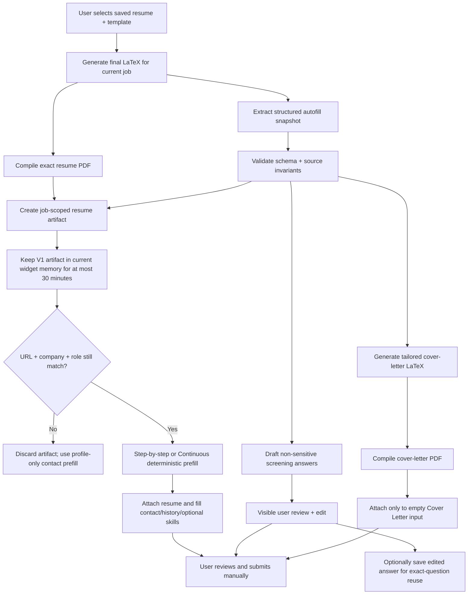

# Job-Scoped Generated Resume Autofill

> Date: 2026-07-16  
> Scope: the injected extension widget, job-scoped custom-resume generation,
> contact/resume/history/skills prefill, AI screening-question drafts, tailored
> cover letters, and safe attachment on Workday, Greenhouse, and generic
> standards-based application forms.

## Status

**Implementation audit: 2026-07-25.**

- Phases 1, 1B, 1C, and 3 have substantial implementation merged to `main`,
  but the extension remains **unreleased at `0.1.11`**.
- The deterministic artifact, contact, resume, history, education, skills, and
  prefill-mode core is implemented and tested. The unchecked items below are
  real blockers or incomplete acceptance criteria, not missing checkbox
  maintenance.
- **AI screening-answer generation is NOT FUNCTIONAL — safely disabled.** The
  UI/background path is off and the route returns `501`; real grounded
  generation remains a later milestone.
- **Initial cover-letter generation is NOT FUNCTIONAL — safely disabled.** The
  UI/background path is off, the route returns `501`, and the fake PDF emitter
  has been removed.
- Stage 1 implements production-safe, atomic AI quotas and a shared
  sensitive-question policy, pending migration/review. Stage 2 adds independent
  safe-default rollout flags: artifact/history/adapters on; skills, Continuous,
  AI drafts, and cover letters off.
- The job-portal content script uses `all_frames: true` and
  `match_about_blank: true` without adding a Chrome permission. The Web Store
  release checklist must justify this frame access and verify the existing host
  match scope.

See
[`AUDIT-AND-ROLLOUT-MASTER-PLAN.md`](./AUDIT-AND-ROLLOUT-MASTER-PLAN.md)
for criterion-by-criterion evidence and the ordered rollout gates.

## Executive decision

**[MODIFIED — launch scope compressed and expanded]**

Yes, this is possible in the current TrackMyOPT architecture, and the first
useful version should ship as a compressed 2–3 sprint milestone rather than a
sequence of four architecture-heavy milestones.

The current code already does one useful part correctly: after a custom resume
is generated in the widget, that exact PDF is held in memory for the current
job and is passed to the prefill engine for attachment. It does **not**, however,
use the generated resume as the source for company names, job titles, employment
dates, education, experience descriptions, or skills. Those fields are not
represented in the current extension autofill contract.

The first release will introduce a **job-scoped generated resume artifact**
containing:

1. The exact generated PDF.
2. A validated structured snapshot of the exact generated resume.
3. The selected base-resume ID and generated-content hash.
4. The job URL, company, and role to which it belongs.
5. A simple 30-minute expiration.
6. An optional tailored cover-letter PDF derived from the same hash-locked
   snapshot.

When the user clicks **Prefill application**, the extension must validate that
artifact against the current URL, company, role, and expiration time.
Resume-backed fields must come from the matching artifact or remain blank. They
must never silently fall back to a different saved or previously generated
resume.

Two adjacent features will be developed in parallel:

- AI-generated screening-question drafts grounded in the job description and
  generated resume snapshot, with mandatory review/edit.
- A tailored cover letter compiled and attached with the same safe file-input
  rules as the resume.

The V1 design intentionally does not add a persistent tab registry, opener-tab
handoff, or new-tab confirmation flow. Those are conditional reliability work,
not launch blockers.

## Product requirement in one sentence

**[MODIFIED — expanded beyond resume fields]**

> Use the exact custom resume generated for this job to prefill and attach the
> application materials, offer grounded drafts for non-sensitive screening
> questions, and always leave review and submission under the user's control.

## What works today and what does not

**[MODIFIED — new launch capabilities and gaps added]**

| Capability                                                               |                Current status | Evidence                                                                         |
| ------------------------------------------------------------------------ | ----------------------------: | -------------------------------------------------------------------------------- |
| Generate a custom resume from a user-selected saved resume               |                           Yes | `generateTailoredResume()` in `apps/extension/src/background.ts`                 |
| Compile and return the exact generated PDF                               |                           Yes | `generateTailoredResume()` returns `pdfBase64`                                   |
| Bind the generated PDF to a job in the current document                  |                 Yes, narrowly | `generatedResumeForCurrentJob` and `jobFingerprint()` in `content-job-portal.ts` |
| Attach that PDF to an empty Resume/CV file input                         | Yes, where the ATS permits it | `attachGeneratedResume()` in `easy-apply-engine.ts`                              |
| Fill name, email, phone, location, years of experience, and profile URLs |                           Yes | `AutofillProfile`, `valueForKind()`, and `GET_AUTOFILL_PROFILE`                  |
| Fill company, title, employment dates, or experience descriptions        |                            No | No work-history types or mappings exist                                          |
| Fill education from the generated resume                                 |                            No | No education types or mappings exist                                             |
| Fill a dedicated skills field from `snapshot.skills`                     |                            No | `FieldKind` has no `skills` member                                               |
| Generate answers for free-text screening questions                       |                            No | Essay-like fields are intentionally skipped                                      |
| Reuse a user's edited answer for an identical future question            |                            No | No answer-library contract or persistence exists                                 |
| Generate and attach a tailored cover letter                              |                            No | Cover-letter inputs are intentionally excluded from resume attachment            |
| Support step-by-step prefill                                             |                           Yes | The user explicitly clicks Prefill on each visible step                          |
| Support continuous per-step prefill                                      |                            No | No popup preference or debounced step observer exists                            |
| Preserve the artifact across reloads or new tabs                         |   No, and not required for V1 | The artifact is currently a module-level value                                   |
| Guarantee that resume fields and attached PDF are the same version       |                            No | Only the PDF is carried into prefill; no generated structured snapshot exists    |

## Current implementation trace

**[MODIFIED — new feature implications added]**

### 1. Generation

**[MODIFIED — cover-letter reuse path identified]**

The widget sends `GENERATE_RESUME` to the extension background worker. The
background worker:

1. Loads the explicitly selected saved resume.
2. Calls `/api/resume-generator/generate` to create tailored LaTeX.
3. Compiles that LaTeX into a PDF.
4. Optionally repairs invalid LaTeX and compiles again.
5. Scores the final LaTeX.
6. Creates an editor handoff.
7. Returns the PDF as base64 to the content script.

This is a good foundation because generation starts from an explicit
`resumeId`; it is not blindly using a random historical resume. The same
compile infrastructure can also produce a cover-letter PDF.

### 2. Job scoping

**[MODIFIED — V1 remains in-memory and time-bound]**

After generation, `renderResumeResult()` assigns:

```ts
generatedResumeForCurrentJob = {
  jobFingerprint: jobFingerprint(job),
  pdfBase64,
  filename,
};
```

`generatedResumeFor(job)` returns the PDF only when the current fingerprint
matches. This prevents obvious same-document reuse on another posting.

For V1, this state remains intentionally in memory. It will gain `generatedAt`,
`expiresAt`, the structured snapshot, and direct URL/company/role comparison.
It will not gain a tab registry or cross-tab handoff before launch.

### 3. PDF attachment

**[MODIFIED — separate cover-letter classifier required]**

The widget passes the current PDF into both the top-frame prefill engine and the
child-frame relay:

```ts
chrome.runtime.sendMessage({ type: 'PREFILL_CHILD_FRAMES', resume });
const result = await runPrefill({ resume });
```

`attachGeneratedResume()` converts base64 to a `File`, finds an empty file
input confidently labeled Resume/CV, uses `DataTransfer`, and dispatches input
and change events. It refuses to overwrite an existing file and refuses fields
labeled for a cover letter, photo, transcript, or another document type.

That behavior should be retained. Cover-letter attachment will use a separate
classifier that positively identifies Cover Letter fields rather than weakening
the resume classifier.

### 4. Text-field source

**[MODIFIED — skills and AI-question gaps identified]**

`runPrefill()` separately sends `GET_AUTOFILL_PROFILE`. The returned type has
only:

```ts
firstName;
lastName;
fullName;
email;
phone;
city;
state;
yearsExperience;
linkedinUrl;
portfolioUrl;
```

The values come from `/api/me` and `application_profile`, not from the newly
generated resume.

The classifier reinforces this limitation. `FieldKind` has no employer, job
title, date, work-description, education, or skills field types. In addition,
`ORG_TRAP_RE` intentionally rejects labels containing company, employer,
school, university, or manager because those labels are unsafe without section
context.

This means a field labeled **Company** is currently skipped by design.

`ESSAY_RE` also skips prompts such as “Why do you want to work here?” That
exclusion must remain in the deterministic profile/resume field classifier.
AI screening-question drafting will be a separate, explicitly reviewed path.

### 5. Existing database data is not enough

The `resumes` table has a `structured_data` JSON column, but it is not a usable
canonical resume model today:

- Newly uploaded base resumes are saved with `structuredData: {}`.
- Generated resumes store editor metadata such as LaTeX, job description, ATS
  score, and template ID, not normalized employment and education records.
- `/api/resume-generator/base-resume` currently returns only `id`, `filename`,
  `content`, and `updated_at`.
- The in-widget generated resume is not saved as a new `resumes` row; it is
  returned as a PDF and optionally placed into a short-lived editor handoff.

The existing column can later hold a versioned `autofillSnapshot`, but it should
not be treated as populated or trustworthy without validation.

### 6. Existing extension points for the new features

**[NEW]**

The codebase already provides useful seams:

- `latex-to-plain-text.ts` can normalize the final generated LaTeX before
  structured extraction.
- `compile` can compile both resume and cover-letter LaTeX.
- `SENSITIVE_FIELD_RE` centralizes high-risk application questions.
- `getLabelText()` already collects semantic field signals.
- `setNativeValue()` already dispatches framework-compatible events.
- `PREFILL_CHILD_FRAMES` already relays explicit prefill actions to extension
  content scripts in child frames.
- `prefill-coverage.ts` can be extended to report resume, cover-letter, skills,
  history, and question-review outcomes separately.

## Why a PDF-only solution is insufficient

**[MODIFIED — snapshot now serves skills, AI drafts, and cover letters]**

An application form cannot reliably derive work history from a PDF in the
browser. ATS systems expose individual fields such as:

- Employer
- Job title
- Location
- Start month/year
- End month/year
- Currently employed
- Role description
- School
- Degree and field of study
- Skills

The extension needs structured values before it touches the DOM. Parsing the
PDF at click time would be slow, template-dependent, difficult to validate, and
could produce data that does not exactly match the generated version.

The correct boundary is the resume-generation pipeline: create and validate a
structured snapshot from the final generated content, then keep that snapshot
and the compiled PDF together as one artifact.

The same snapshot also gives AI question drafting and cover-letter generation a
single truthful source rather than letting each feature reinterpret raw resume
text independently.

## Required source-of-truth rules

**[MODIFIED — V1 validity and skills behavior added]**

These rules are the core of the feature and should be tested as invariants.

### Rule 1 — generated artifact first

**[MODIFIED — 30-minute exact-context validity added]**

For resume-backed fields, use only the active artifact generated for the
current job context. In V1, “active” means:

- generated less than 30 minutes ago;
- current normalized job URL matches;
- current normalized company matches; and
- current normalized role matches.

If any condition fails, the artifact is inactive immediately.

### Rule 2 — no historical-resume fallback

**[MODIFIED — skills added to protected resume-backed fields]**

If the artifact is missing, expired, belongs to another job, or fails schema
validation, leave work history, education, and skills blank. Do not query
“latest resume,” the last opened resume, or any other saved resume.

### Rule 3 — limited profile fallback

The account/application profile may fill only missing basic contact fields:

- name
- email
- phone
- city/state
- LinkedIn
- portfolio

It must not supply employer, role, dates, descriptions, education, projects, or
skills for an artifact-backed application.

For the strictest interpretation of “everything from this resume,” even contact
fields should prefer the artifact and use the profile only when the artifact
does not contain the value.

### Rule 4 — never use OPT employment spans as resume history

`employment_spans` exists for OPT/unemployment-clock calculations. It is not a
resume source and may be incomplete or intentionally different from a resume.
It must not be merged into application work history.

### Rule 5 — never overwrite the applicant

Retain the current invariant: any non-empty field or existing uploaded file is
left unchanged.

### Rule 6 — sensitive answers remain manual

Never store or fill work authorization, visa/sponsorship, citizenship, EEO,
demographic data, salary, date of birth, SSN, disability, or veteran answers.

### Rule 7 — no silent “Add another” automation in the first release

The current engine never clicks buttons. The first implementation should fill
only experience/education rows that are already visible. If more records are
available, show:

> 2 more experience entries are ready. Add another row, then click Prefill
> again.

Automating ATS **Add another** buttons would change a deliberate product and
compliance invariant and should be reviewed separately.

### Rule 8 — skills are explicit opt-in

**[NEW]**

Skills autofill is disabled by default and enabled only by the user's extension
setting. It uses `snapshot.skills` only, targets dedicated skills inputs only,
and never treats a general essay, years-of-experience question, or
technology-specific experience question as a skills field.

### Rule 9 — expiry never triggers silent field clearing or silent re-fill

**[NEW]**

When an artifact expires or invalidates, values and files previously filled
from it remain in the application exactly as they are. TrackMyOPT never clears,
replaces, or silently re-fills them. Rule 5 continues to apply because the user
may have reviewed or edited those values after the original fill.

## Important truthfulness prerequisite

**[MODIFIED — cover-letter consistency added]**

Before work-history autofill is enabled, review the resume-generation prompt.
The current prompt explicitly allows aggressive job-title rewriting while also
requiring company names and dates to remain unchanged.

Automatically copying a rewritten title into an employer application raises
the risk of submitting a title that was optimized rather than verified. The
recommended rule is:

- Preserve official company names, official job titles, schools, degrees, and
  employment/education dates.
- Tailor summaries, skills ordering, and truthful bullets.
- If title normalization remains a product requirement, show the generated
  title in a review screen and require explicit confirmation before it becomes
  eligible for application autofill.
- Generate screening drafts and cover letters only from the validated snapshot;
  never introduce companies, titles, dates, degrees, projects, metrics, or
  skills that are absent from it.

The attached resume, populated application, screening answers, and cover letter
must not disagree. Agreement alone is not enough; the shared data must also be
user-verified.

## Target architecture

**[MODIFIED — V1 lifecycle simplified; parallel AI and cover-letter paths added]**



### Artifact contract

**[MODIFIED — core preserved; optional cover-letter payload added]**

The contract remains versioned from day one. No original field is removed.
`coverLetter` is optional so Phase 1C can attach a hash-locked companion file
without changing resume-prefill behavior.

```ts
interface GeneratedResumeArtifactV1 {
  schemaVersion: 1;
  artifactId: string;
  sourceResumeId: string;
  sourceResumeFilename: string;
  templateId: string;
  job: {
    jobKey: string;
    companyName: string;
    roleTitle: string;
    sourceUrl: string;
    requisitionId?: string;
  };
  generatedAt: string;
  expiresAt: string;
  generatedContentHash: string;
  pdf: {
    filename: string;
    base64: string;
    sha256: string;
  };
  snapshot: ResumeAutofillSnapshotV1;
  coverLetter?: {
    filename: string;
    base64: string;
    sha256: string;
    generatedAt: string;
    sourceContentHash: string;
  };
}

interface ResumeAutofillSnapshotV1 {
  contact: {
    firstName?: string;
    lastName?: string;
    fullName?: string;
    email?: string;
    phone?: string;
    city?: string;
    state?: string;
    country?: string;
    linkedinUrl?: string;
    portfolioUrl?: string;
  };
  summary?: string;
  totalYearsExperience?: number;
  skills: string[];
  experience: Array<{
    company: string;
    title: string;
    location?: string;
    startDate: ResumeDateValue;
    endDate?: ResumeDateValue;
    isCurrent: boolean;
    bullets: string[];
    descriptionText: string;
  }>;
  education: Array<{
    school: string;
    degree?: string;
    fieldOfStudy?: string;
    location?: string;
    startDate?: ResumeDateValue;
    endDate?: ResumeDateValue;
  }>;
  certifications: Array<{
    name: string;
    issuer?: string;
    issuedDate?: ResumeDateValue;
  }>;
}

interface ResumeDateValue {
  originalText: string;
  year?: number;
  month?: number;
  precision: 'month' | 'year' | 'text';
}
```

Keep `originalText` so the user can see exactly what appeared on the generated
resume. Use normalized month/year values only when a matching ATS control
requires them. Never invent a missing month.

The optional cover letter must set `sourceContentHash` equal to
`generatedContentHash`. A mismatch makes it ineligible for attachment.

### Artifact identity

**[MODIFIED — exact V1 context rule]**

V1 identity is deliberately simple. The artifact stores the normalized:

1. Job URL.
2. Company name.
3. Role title.

All three must match at prefill time. The URL normalizer may remove only
non-semantic fragments and known tracking parameters; it must not collapse
different requisitions or application routes into one job.

An ATS requisition ID can remain in `jobKey` for diagnostics, but V1 does not
use fuzzy matching, opener-tab inheritance, or “close enough” job reassignment.

### V1 artifact lifecycle

**[MODIFIED — live reliability correction]**

V1 keeps exactly one active artifact. The background service worker owns it,
uses a module-level value as a fast cache, and stores the same bounded value in
`chrome.storage.session` so MV3 worker recreation cannot discard it during a
same-job application-route navigation:

- **Generate:** set `generatedAt` and `expiresAt = generatedAt + 30 minutes`.
- **Prefill:** re-check expiration, URL, company, role, schema, and content
  hashes immediately before filling.
- **Generate again:** replace the single background/session artifact; never
  retain a second job artifact.
- **URL/company/role changes:** invalidate and discard the artifact immediately.
- **User edits the generated resume:** invalidate the artifact until the edited
  version is recompiled and revalidated.
- **Reload or content-script recreation:** ask the background resolver, rehydrate
  from `chrome.storage.session` if needed, and run the full validation chain.
- **New tab:** no automatic handoff or tab association is inferred.
- **Sign-out:** clear both the memory cache and session artifact.

The session store uses one fixed key and a serialized-size ceiling below
Chrome's 10 MiB quota. Oversized artifacts are not persisted. This is not a
tab registry: there is still no tab binding, opener-tab inheritance, cross-job
selection, or new-tab handoff confirmation UI in V1.

This is an intentional time-to-market tradeoff. The widget should explain expiry
or context mismatch clearly rather than silently selecting another resume.

#### Behavior when the artifact expires or invalidates mid-form

**[NEW]**

If the artifact expires, or its URL/company/role validation fails after one or
more application fields have already been filled:

- fields, tags, and files filled earlier are **never auto-cleared**;
- Continuous mode stops further artifact-backed filling immediately;
- the widget displays a persistent, visible warning:

  > Resume link expired — fields filled earlier may be stale

- the widget offers one explicit, one-click action:
  **Regenerate and re-check filled fields**; and
- Rule 5 still protects every non-empty value because the user may have edited
  it after TrackMyOPT's original fill.

The re-check action creates and validates a new artifact, compares eligible
visible fields against the newly validated snapshot, and shows which values may
need review. It does not silently blank, replace, re-attach, or re-fill
anything. Any resulting change requires an explicit user action.

### Phase 2 — Reliability Hardening lifecycle

**[MODIFIED — deferred and conditional]**

Build the full lifecycle only if support and funnel data show users abandon
applications because the artifact expires or disappears during navigation.
That optional phase may add:

- a background-owned registry keyed by artifact and tab;
- `chrome.storage.session` persistence with size checks;
- same-application route continuity;
- opener-tab/new-tab association and explicit confirmation;
- tab-close, sign-out, update, browser-restart, and TTL cleanup; and
- child-frame result aggregation across multi-page flows.

Phase 2 is not a launch dependency for Phase 1, Phase 1B, Phase 1C, Phase 3, or
the Workday/Greenhouse adapters.

## Structured snapshot generation

Build the snapshot from the **final LaTeX after any repair**, not from the base
resume and not from the initial model response. This guarantees that the
snapshot corresponds to the PDF that actually compiled.

The current templates use multiple structures (`\resumeSubheading` in several
templates and `\subsection`/`\subtext` in others), so one large regular
expression will be brittle. Use a layered pipeline:

1. Convert final LaTeX to normalized plain text with the existing
   `apps/web/lib/resume/latex-to-plain-text.ts` utilities.
2. Extract a strictly structured object using a schema-constrained parser.
3. Validate the object with Zod.
4. Reconcile immutable fields against the selected source resume:
   - contact identity
   - companies
   - official titles
   - employment dates
   - schools
   - degrees
5. Mark ambiguous fields unavailable rather than guessing.
6. Hash the final LaTeX and store that hash on the artifact.

The structured extractor should not consume another visible “resume
generation” quota. If an AI-assisted extractor is used, it needs its own rate
limit, bounded input, no logging of resume text, deterministic schema, and
failure handling that still returns the PDF while disabling structured fields.

### Long-term implementation

The durable architecture is a canonical structured resume model from which both
LaTeX and autofill data are rendered. That removes the need to reverse-parse
LaTeX. It is a larger resume-generator refactor and should not block the first
delivery.

## Prefill payload resolution

**[MODIFIED — in-memory V1 resolver replaces registry design]**

V1 resolves the payload inside the current content-script/widget context,
rather than introducing a background artifact registry. The existing background
worker still resolves the authenticated profile fallback and keeps the Bearer
token isolated.

```ts
type V1PrefillPayloadRequest = {
  now: string;
  jobContext: {
    jobUrl: string;
    companyName: string;
    roleTitle: string;
  };
};

type V1PrefillPayloadResponse =
  | {
      ok: true;
      source: 'generated_resume';
      artifactId: string;
      artifactLabel: string;
      snapshot: ResumeAutofillSnapshotV1;
      resume: GeneratedResumeAttachment;
      coverLetter?: GeneratedCoverLetterAttachment;
      profileFallback: BasicContactProfile;
    }
  | {
      ok: true;
      source: 'profile_only';
      reason: 'missing' | 'expired' | 'job_changed' | 'invalid';
      profileFallback: BasicContactProfile;
    }
  | { ok: false; error: 'not_signed_in' | 'unavailable' };
```

The resolver sequence is:

1. Read the current in-memory artifact.
2. Validate schema version and hashes.
3. Compare the current normalized URL, company, and role.
4. Compare `now` to `expiresAt`.
5. Request the basic profile fallback from the background worker.
6. Return one explicit source status.

For cross-origin application frames, the top frame may relay the already
resolved payload through the existing `PREFILL_CHILD_FRAMES` action. The
artifact is passed only during an explicit prefill run—or during a Continuous
mode run that the user explicitly enabled—and is not persisted in the frame.

## Work-history and education field mapping

**[MODIFIED — optional skills added; launch adapters reduced]**

Do not remove `ORG_TRAP_RE` or classify every field labeled Company globally.
That would create false fills in fields such as referral company, current
company email, manager, or company website.

Add a separate **section-aware repeatable-record engine**.

### Context model

**[MODIFIED — skills control added]**

```ts
type FormSectionKind =
  | 'contact'
  | 'experience'
  | 'education'
  | 'skills'
  | 'unknown';

interface ClassifiedControl {
  element: HTMLInputElement | HTMLTextAreaElement | HTMLSelectElement;
  section: FormSectionKind;
  recordIndex?: number;
  field:
    | 'company'
    | 'title'
    | 'location'
    | 'startMonth'
    | 'startYear'
    | 'endMonth'
    | 'endYear'
    | 'isCurrent'
    | 'description'
    | 'school'
    | 'degree'
    | 'fieldOfStudy'
    | 'skills';
}
```

### Safe matching sequence

**[MODIFIED — skills and V1 adapter behavior added]**

1. Find a section using headings, fieldset legends, ARIA relations, ATS data
   attributes, and nearby text.
2. Find repeated record containers within experience or education.
3. Assign a stable record index in visible DOM order.
4. Classify controls only inside the known record container.
5. Map generated resume experience in its displayed order—normally most recent
   first—to record containers in the same order.
6. Fill only empty native inputs/selects with confident matches.
7. Classify skills only in a dedicated skills section/input and only when the
   user enabled skills autofill.
8. For custom date pickers, typeaheads, comboboxes, and tag editors, use a
   tested V1 adapter or leave the field for the user.
9. Report remaining generated records and skipped controls.

### Adapter boundary

**[MODIFIED — scope reduced to Workday and Greenhouse for launch]**

Keep a generic semantic adapter and ship only Workday and Greenhouse-specific
adapters in the first release:

```ts
interface AtsPrefillAdapter {
  id: 'generic' | 'workday' | 'greenhouse';
  matches(document: Document): boolean;
  findApplicationRoot(document: Document): HTMLElement | null;
  classifyRepeatableSections(root: HTMLElement): ClassifiedControl[];
}
```

Lever, Ashby, and iCIMS are **fast-follow, data-driven additions** after usage
telemetry and support requests show real demand. They are removed from the V1
launch plan. Other ATS pages receive the conservative generic semantic engine;
they do not receive an untested dedicated adapter.

Platform adapters must not weaken the global sensitive-field,
never-overwrite, or never-auto-submit rules.

### Skills-field autofill

**[NEW]**

Add `skills` to the flat classifier without allowing it to match general essay
or experience questions:

```ts
export type FieldKind =
  | 'email'
  | 'phone'
  | 'firstName'
  | 'lastName'
  | 'fullName'
  | 'city'
  | 'state'
  | 'location'
  | 'yearsExperience'
  | 'linkedinUrl'
  | 'portfolioUrl'
  | 'skills';

interface AutofillPreferences {
  mode: 'step_by_step' | 'continuous';
  autofillSkills: boolean;
}
```

Requirements:

- `autofillSkills` defaults to `false`.
- The toggle lives in extension settings/popup; storing the boolean preference
  in `chrome.storage.sync` is acceptable because no resume data is stored there.
- Source values come only from the active artifact's `snapshot.skills`.
- Match only dedicated fields labeled Skills, Technical Skills, Core Skills, or
  equivalent—not “years of Java experience,” “describe your skills,” or
  technology-specific eligibility questions.
- For a plain text field, insert a bounded comma-separated list.
- For a tag-style control, add tags only through a tested Workday or Greenhouse
  adapter that proves the host framework accepted each value.
- Never overwrite existing text or existing tags.
- Continuous mode respects the same opt-in and classification rules.

## AI-Generated Screening Question Answers

**[NEW]**

This feature detects non-sensitive free-text application questions that are not
covered by deterministic resume/profile fields, for example:

- “Why do you want to work here?”
- “Describe a relevant project.”
- “How does your experience prepare you for this role?”
- “What interests you about this team?”

It must not relax `ESSAY_RE` inside `classifyField()`. Instead, add a separate
screening-question detector that:

1. Collects the full label/question text and any character limit.
2. Rejects empty, hidden, disabled, or already-filled controls.
3. Applies `SENSITIVE_FIELD_RE` before any AI request.
4. Rejects work-authorization, visa/sponsorship, citizenship, EEO,
   demographic, salary, DOB, SSN, disability, veteran, and clearance questions.
5. Rejects fields already classified as contact, history, education, or skills.
6. Presents eligible questions to the user before generating or inserting text.

### Draft-generation contract

**[NEW]**

Drafts use only the job description, company name, role title, and validated
generated resume snapshot.

```ts
interface ScreeningQuestionDraftRequest {
  questionText: string;
  characterLimit?: number;
  job: {
    companyName: string;
    roleTitle: string;
    jobDescription: string;
  };
  snapshot: ResumeAutofillSnapshotV1;
  sourceContentHash: string;
}

interface ScreeningQuestionDraftResponse {
  ok: boolean;
  questionHash: string;
  draft?: string;
  sourceContentHash?: string;
  error?: 'sensitive' | 'insufficient_context' | 'limit' | 'generation_failed';
}

interface SavedScreeningAnswer {
  questionHash: string;
  normalizedQuestionText: string;
  editedAnswer: string;
  source: 'user_edited_ai_draft' | 'user_written';
  createdAt: string;
  updatedAt: string;
}
```

The generation prompt must:

- ground every claim in `snapshot`;
- use the job description for relevance, not invented qualifications;
- respect the field's character limit;
- avoid sensitive status or demographic inferences; and
- return plain text only.

### Mandatory review and edit-before-use

**[NEW]**

AI text is a draft, not an application answer:

1. Show the draft visibly in the widget or a review panel.
2. Require an explicit **Insert draft** action.
3. Insert only into an empty eligible field.
4. Mark the field “Needs your review/edit.”
5. Listen for a trusted user input event and keep the extension status
   incomplete until the user edits or explicitly confirms the reviewed text.
6. Never click Next, Review, Submit, Done, or any host-page action.

The extension cannot and should not take control of the ATS submit button. Its
responsibility is to make review status visible and never represent untouched AI
text as completed.

Continuous mode may detect eligible questions and surface draft actions, but it
must never generate or insert AI answers automatically.

### Save and exact-question reuse

**[NEW]**

After the user edits an inserted draft—or writes the answer manually—offer to
save the final text to a user-scoped answer library.

The reuse key is a hash of the exact question text after only benign whitespace
normalization (trim and collapse repeated whitespace). Do not semantically match
different questions in V1.

When the same question appears later:

- show **Use your previously edited answer**;
- show the saved answer and last-edited date;
- require the user to review before insertion;
- provide **Regenerate fresh** using the current job and resume snapshot; and
- never overwrite a non-empty field.

Store answer-library records server-side under the authenticated user with RLS,
bounded lengths, encryption at rest through the existing platform, and explicit
delete controls. Do not include answer text in analytics.

#### Known V1 limitation

**[NEW]**

Reuse matching is exact-text only after benign whitespace normalization.
Semantically similar but differently worded questions do not match. For
example, “Why do you want to work here?” and “Why are you interested in this
role?” are treated as different questions and prompt fresh generation.

The answer-library UI must state **Matches identical questions only**. Semantic
or fuzzy question matching is a fast-follow candidate for Phase 2, not a launch
blocker. Track only low-cardinality duplicate-question frequency—not question
text—to decide whether later fuzzy matching is justified.

### AI generation limits

**[NEW]**

Screening-answer drafts and cover-letter generations share one per-user AI
generation bucket that is separate from the resume-generation quota.

V1 limits:

- **Combined daily cap:** an engineering/finance-configured limit across
  screening-answer drafts and cover-letter generations; placeholder:
  **25 generations per user per day**.
- **Per-item regeneration cap:** an engineering/finance-configured limit;
  placeholder: **3 regenerations per question** for screening answers and
  **3 regenerations per job** for cover letters.
- The combined daily cap counts initial generations and regenerations.
- Per-item counters apply to regenerations after the initial result.

```ts
interface AiGenerationLimitState {
  allowed: boolean;
  dailyLimit: number;
  dailyRemaining: number;
  itemRegenerationLimit: number;
  itemRegenerationsRemaining: number;
  resetsAt?: string;
  error?:
    | 'ai_daily_limit_reached'
    | 'ai_item_regeneration_limit_reached'
    | 'ai_rate_limited';
}
```

Enforcement is server-side and atomic; client-side disabling is only a UX
convenience. Screening drafts key the item cap by authenticated user plus
`questionHash`. Cover letters key it by authenticated user plus normalized job
identity and `sourceContentHash`.

Every generation response returns the authoritative remaining daily and
per-item counts. When blocked, the widget receives a clear error state and
shows whether the daily cap, item regeneration cap, or short-window rate limit
was reached. The client must not issue an AI request after a server response
reports zero remaining for the relevant limit.

## Cover Letter Generation and Attachment

**[NEW]**

Generate a tailored cover letter from:

- the same validated `ResumeAutofillSnapshotV1` used for application prefill;
- the same `generatedContentHash`;
- the job description;
- the company name; and
- the role title.

The cover letter must not parse the resume PDF independently or use a different
saved resume. It should be generated as LaTeX, compiled with the existing PDF
compile infrastructure, and stored in the optional `artifact.coverLetter`
payload.

### Generation contract

**[NEW]**

```ts
interface GenerateCoverLetterRequest {
  snapshot: ResumeAutofillSnapshotV1;
  sourceContentHash: string;
  job: {
    companyName: string;
    roleTitle: string;
    jobDescription: string;
  };
}

interface GeneratedCoverLetterAttachment {
  filename: string;
  base64: string;
  sha256: string;
  generatedAt: string;
  sourceContentHash: string;
}
```

Generation rules:

- Use only claims supported by the validated snapshot.
- Never invent employers, titles, dates, degrees, skills, projects, or metrics.
- Make the company/role motivation specific to the supplied job description.
- Show the letter for user review and provide Download/Edit actions.
- Recompile and replace the optional artifact payload after an edit.
- Reject attachment when `sourceContentHash !== generatedContentHash`.

### AI generation limits

**[MODIFIED — gap closed]**

Cover-letter generation and regeneration consume the shared server-enforced AI
generation bucket defined under **AI-Generated Screening Question Answers**.
The cover-letter endpoint returns the same `AiGenerationLimitState`, applies the
combined daily cap, and enforces the per-job regeneration cap before invoking
the model or compiler.

### Attachment rules

**[NEW]**

Add `attachGeneratedCoverLetter()` as a separate path:

- positively identify a file input labeled Cover Letter or Letter of Interest;
- reject Resume/CV, portfolio, transcript, photo, certificate, or other file
  fields;
- require an empty, enabled input;
- honor the input's accepted file types;
- attach the compiled PDF using the same `DataTransfer` and event-dispatch
  pattern as resume attachment;
- never overwrite an existing file; and
- report `attached`, `already_present`, `not_found`, or `unsupported` separately
  from resume attachment.

Continuous mode may attach the reviewed cover letter when an eligible empty
field appears, but it must re-check the artifact hash and never replace a file.

## User experience

**[MODIFIED — new materials, answer review, and prefill modes added]**

### Before generation

Keep the explicit saved-resume selector. It is valuable evidence of user intent.

### After generation

**[MODIFIED — expiry, review data, and cover-letter action added]**

Change the success state from only **Resume ready** to include the active source:

> Resume ready for Software Engineer at Acme
> Based on `Ashish-Software-Resume.pdf` · expires in 28 minutes
> This resume will be used for PDF upload and resume-backed application fields.

Provide **Review autofill data** so the user can inspect contact, experience,
education, and skills before using it.

Offer **Generate cover letter** without blocking resume readiness.

### Before prefill

**[MODIFIED — expiry/context mismatch replaces cross-tab handoff]**

If the artifact matches:

> Prefill application + this resume

If no artifact matches:

> Prefill profile fields

If an artifact expired or the job context changed:

> This generated resume is no longer active for this job. Generate again or
> continue with profile-only prefill.

Never hide expiry or mismatch by substituting the latest resume.

### After prefill

**[MODIFIED — new grouped outcomes added]**

Expand coverage reporting by field group:

> Resume attached · Cover letter attached · 6 contact fields · 10 experience
> fields · 4 education fields · 1 skills field filled · 2 questions need review

Do not include company names, titles, question text, answers, or resume content
in analytics events.

### AI generation usage visibility

**[NEW]**

Screening-answer and cover-letter controls show the authoritative server-returned
remaining counts **before** the user generates or regenerates.

Example screening-answer copy:

> You have 5 AI generations left today.
>
> Regenerate fresh — 2 of 3 regenerations remaining.
>
> 3 of 3 regenerations used for this question.

Example cover-letter copy:

> You have 5 AI generations left today.
>
> Regenerate cover letter — 1 of 3 regenerations remaining for this job.

`Regenerate fresh` and `Regenerate cover letter` buttons include the remaining
item count in their visible label before the click. When the daily or per-item
cap is reached, disable the affected generation action and show a clear message
with the reset time when the server provides one; do not wait for another failed
request before explaining the limit.

### Prefill modes

**[NEW]**

The extension popup includes one mode toggle:

#### Step-by-step

**[NEW]**

- Default mode.
- The user clicks **Prefill** on each application page/step.
- Matches current product behavior and is easiest to understand and audit.

#### Continuous

**[NEW]**

- Explicit user opt-in from the extension popup.
- Watches for a new application step or newly visible controls.
- Debounces DOM/route observations and runs the same idempotent, no-overwrite
  prefill engine once per new control set.
- Revalidates the artifact's 30-minute TTL, URL, company, role, schema, and
  hashes before every run.
- Can fill deterministic contact/resume/history/education fields, optional
  skills, and safe file attachments.
- Can detect AI-eligible screening questions but only surfaces review actions;
  it never generates or inserts an AI answer automatically.
- Never clicks Add another, Next, Review, Done, or Submit.
- Stops and shows profile-only/manual guidance when the artifact expires or the
  job context changes.

The preference may be stored as a non-sensitive boolean/string setting. Resume,
cover-letter, or answer content must not be stored with the preference.

## Phased implementation plan

**[MODIFIED — roadmap compressed and launch adapters reduced]**

Competitors ([Simplify](https://help.simplify.jobs/en/articles/1749022-installing-and-setting-up-copilot), [Careerflow](https://www.careerflow.ai/autofill), and [JobWizard](https://jobwizard.ai/features/smart-autofill)) already ship equivalent resume-plus-contact autofill, so TrackMyOPT must not spend multiple quarters on internal architecture before shipping.

Phase 1 is one integrated 2–3 sprint milestone with parallel workstreams, not
four serial architecture phases or four launch-gating PRs. Work may still be
reviewed in small commits/PRs, but contract, snapshot, V1 artifact, and basic
prefill ship behind one feature flag and one milestone definition of done.

### Phase 1 — Core Artifact & Basic Prefill — **2–3 sprints total**

**[MODIFIED — former Phases 0, 1, 2, and 3 merged]**

**Goal:** ship the exact generated resume PDF and snapshot as one V1 artifact,
then use it for basic contact/resume prefill without building a persistent tab
registry.

#### Integrated work

- [x] Preserve official titles and reject normalized/rewritten titles from the
      autofill snapshot.
- [x] Add `ResumeAutofillSnapshotV1` and `GeneratedResumeArtifactV1` schemas,
      limits, and cross-resume contamination fixtures.
- [x] Add the final-LaTeX-to-snapshot pipeline after compile repair.
- [x] Validate immutable fields against the selected source resume.
- [x] Return the snapshot, final-content hash, and exact PDF together.
- [x] Add the single-active, session-scoped 30-minute artifact and exact
      URL/company/role check without using `chrome.storage.sync`.
- [x] Prefer artifact contact data and use `application_profile` only for
      missing contact values.
- [x] Attach the exact resume PDF from the same artifact.
- [x] Add `skills` to `FieldKind` behind the default-off setting.
- [x] Add Step-by-step/Continuous popup preference; Continuous uses the same
      engine and never clicks navigation/submission controls.
- [x] Pass the resolved artifact through the existing child-frame relay only
      during a permitted prefill run.
- [x] Show artifact filename, job, and expiry; explain missing, expired,
      changed-job, and invalid states.
- [x] Extend grouped coverage for resume, contact, and optional skills.
- [x] Preserve sensitive-field, no-overwrite, and no-auto-submit invariants.

#### Acceptance criteria

- The snapshot and PDF originate from the same final generated LaTeX.
- At 29:59 the matching artifact can be used; at 30:00 it cannot.
- Any URL, company, or role change invalidates the artifact.
- A different saved or previously generated resume is never selected
  implicitly.
- The resume attaches only to an empty Resume/CV input.
- Contact values prefer the matching artifact.
- Skills remain off by default and fill only a dedicated skills input when
  enabled.
- Step-by-step and Continuous modes use identical safety guards.
- Snapshot extraction failure preserves PDF download but disables
  artifact-backed text prefill.

#### Likely files

- Add `apps/web/lib/resume/autofill-schema.ts`
- Add `apps/web/lib/resume/extract-autofill-snapshot.ts`
- Add `apps/web/app/api/resume-generator/autofill-snapshot/route.ts`
- Add `apps/extension/src/resume-autofill-contract.ts`
- Modify `apps/web/lib/ai/prompts/generate.ts`
- Modify `apps/extension/src/background.ts`
- Modify `apps/extension/src/content-job-portal.ts`
- Modify `apps/extension/src/easy-apply-engine.ts`
- Modify `apps/extension/src/easy-apply-matchers.ts`
- Modify `apps/extension/src/prefill-coverage.ts`
- Modify extension popup settings and tests

### Phase 1B — AI Question Drafting — **parallel with Phase 1**

**[NEW]**

**Goal:** draft grounded answers for eligible free-text questions and reuse the
user's edited answer when the exact question appears again.

This work does not depend on an artifact registry. It can run in parallel
against the snapshot contract and fixtures while Phase 1 implements the V1
in-memory artifact.

- [x] Add a separate sensitive-first screening-question detector.
- [x] Add the authenticated route boundary and strict request/response schema.
- [ ] **NOT FUNCTIONAL — stub:** ground a real AI-generated draft in the job
      description, company, role, and snapshot. The current route is safely
      gated and returns `501`; no screening-answer prompt exists yet.
- [x] Add visible preview, explicit insert, and needs-review/edit state.
- [x] Detect trusted user edits without taking control of ATS submission.
- [x] Add a user-scoped `screening_answer_library` with RLS and exact-question
      hashes.
- [x] Offer saved edited answers first, plus Regenerate fresh.
- [x] Exclude AI question generation/insertion from Continuous automation.
- [x] Add independent quota/error UI, privacy-safe analytics counts, and an
      atomic server-side Supabase quota with UTC reset timestamps.

#### Acceptance criteria

**[MODIFIED — gap closed]**

- Sensitive/EEO/visa questions never reach the generation endpoint.
- Draft claims are traceable to snapshot or job-description context.
- No draft enters a non-empty field.
- Untouched AI text is visibly marked as needing review.
- A saved edited answer is offered only for the exact normalized question hash.
- Regenerate fresh uses the current job/snapshot context.
- Users see the remaining generation count before regenerating and a clear
  message when the daily or per-question cap is reached.
- No answer or question text appears in analytics.

#### Likely files

- Add `apps/extension/src/screening-question-drafts.ts`
- Add `apps/web/app/api/extension/screening-answer/route.ts`
- Add `apps/web/lib/ai/prompts/screening-answer.ts`
- Add a `screening_answer_library` migration and RLS policies
- Modify `apps/extension/src/content-job-portal.ts`
- Extend sensitive-field, answer-reuse, and review-state tests

### Phase 1C — Cover Letter Generation & Attachment — **parallel with Phase 1**

**[NEW]**

**Goal:** generate, compile, review, and safely attach a cover-letter PDF derived
from the same validated snapshot as the resume.

- [x] Add a hash-locked cover-letter request and artifact contract.
- [ ] **NOT FUNCTIONAL — stub:** generate and compile the initial cover letter.
      The current route returns `501`; the fake PDF emitter was removed and the
      existing compile/repair infrastructure is not wired yet.
- [x] Add Download/Edit/Regenerate actions without blocking resume readiness.
- [x] Store the reviewed PDF in optional `artifact.coverLetter`.
- [x] Add a cover-letter-specific file-input classifier and attachment result.
- [x] Enforce empty-input, accepted-file-type, no-overwrite, and hash-match
      checks at the attachment boundary.
- [x] Carry the optional cover letter through resolver/relay and report resume
      and cover-letter attachment separately.

#### Acceptance criteria

**[MODIFIED — gap closed]**

- `coverLetter.sourceContentHash` equals `artifact.generatedContentHash`.
- The letter introduces no unsupported resume claims.
- The PDF attaches only to an empty Cover Letter/Letter of Interest input.
- A resume input or an existing cover letter is never overwritten.
- Compile or attachment failure does not discard the generated resume.
- Users see the remaining generation count before regenerating and a clear
  message when the daily or per-job cap is reached.

#### Likely files

- Add `apps/web/app/api/resume-generator/generate-cover-letter/route.ts`
- Add `apps/web/lib/ai/prompts/cover-letter.ts`
- Add `apps/extension/src/cover-letter-attachment.ts`
- Modify `apps/extension/src/background.ts`
- Modify `apps/extension/src/content-job-portal.ts`
- Extend compile, classifier, and attachment tests

### Phase 2 — Reliability Hardening — **conditional after launch**

**[MODIFIED — deferred; not a V1 dependency]**

**Trigger:** build only if support data shows users abandon or restart
applications because the 30-minute/context-bound artifact expires or disappears.

- [ ] Establish a baseline for artifact-expired, job-changed, reload-lost, and
      new-tab-lost outcomes.
- [ ] Confirm those outcomes correlate with application abandonment/support
      volume before investing.
- [ ] If justified, add a background artifact registry and
      `chrome.storage.session` persistence.
- [ ] Add same-application route continuity without fuzzy cross-job reuse.
- [ ] Add opener/new-tab association and explicit confirmation.
- [ ] Add cleanup for tab close, sign-out, expiry, update, and browser restart.
- [ ] Aggregate child-frame and step-level coverage.

#### Acceptance criteria if triggered

- Reliability gains are measured against the V1 baseline.
- Cross-tab/session reuse never selects another resume silently.
- Persisted payloads remain size-bounded and unavailable to host-page scripts.
- The phase can be omitted without blocking the launch roadmap.

#### Fast-follow candidate: semantic screening-question reuse

**[NEW]**

If low-cardinality analytics show frequent fresh drafts for semantically similar
questions, evaluate privacy-preserving fuzzy matching in Phase 2. This is not a
launch requirement and must retain explicit review, sensitive-question
exclusion, and no-overwrite behavior.

### Phase 3 — Experience & Education Engine

**[MODIFIED — skills share the classifier but remain default-off]**

**Goal:** fill already-visible repeatable history records safely after the core
artifact is shipping.

- [x] Add section-aware company, title, location, date, current-role,
      description, school, degree, and field-of-study mappings.
- [x] Preserve original date precision and never invent missing dates.
- [x] Map records in resume display order.
- [x] Fill only visible, empty controls.
- [x] Integrate dedicated skills fields without widening history classifiers.
- [x] Leave untested custom comboboxes/date pickers/tag controls untouched.
- [x] Show remaining artifact records when the ATS has fewer visible rows.
- [x] Keep Add-another buttons manual.

#### Acceptance criteria

- A two-employer fixture fills the correct two visible work-history records.
- Employer/title/date values never cross record boundaries.
- Referral-company and manager fields remain blank.
- User-entered work history, education, and skills are never overwritten.
- All field values come from the active validated snapshot.

### Phase 4 — Workday & Greenhouse Adapters

**[MODIFIED — scope reduced for first release]**

**Goal:** make the generic engine dependable on the two launch ATS platforms
without delaying release for a broad adapter matrix.

- [ ] Add one Workday adapter from sanitized fixtures.
- [ ] Add one Greenhouse adapter from sanitized fixtures.
- [ ] Support tested native/custom date and tag controls only on those platforms.
- [ ] Re-run Step-by-step or Continuous prefill as new visible controls load.
- [ ] Merge child-frame coverage where required.
- [ ] Keep all buttons—including Add another, Next, Review, Done, and
      Submit—manual.

#### Fast-follow policy

Lever, Ashby, and iCIMS adapters are not launch work. Add them after telemetry
shows enough supported-page sessions, skipped-field volume, or support requests
to justify a tested adapter. Generic conservative prefill may still operate on
those sites.

#### Acceptance criteria

- Workday and Greenhouse pass the shared safety suite.
- Step-by-step and Continuous modes never click navigation or submission.
- Unsupported controls remain blank rather than receiving guessed values.
- No Lever, Ashby, or iCIMS adapter is required for V1 sign-off.

### Phase 5 — Rollout, Monitoring & Cleanup

**[MODIFIED — independent feature flags and new telemetry added]**

**Goal:** ship useful slices early and use real demand to choose the next
investment.

- [x] Gate core artifact prefill, skills, Continuous mode, AI drafts, cover
      letters, history fields, and ATS adapters independently.
- [ ] Start with internal users and sanitized fixtures.
- [ ] Add low-cardinality analytics only: feature flag, adapter ID, mode, source
      type, expiry/mismatch reason, review state, and counts by field group.
- [ ] Add user-visible error reporting without resume, question, answer, or
      cover-letter content.
- [ ] Roll out the core before waiting for Phase 2 hardening.
- [ ] Validate Workday and Greenhouse before broad adapter claims.
- [ ] Use telemetry to prioritize Lever, Ashby, iCIMS, or another ATS.
- [ ] Document AI drafting, answer reuse, cover letters, skills, and Continuous
      mode in privacy/support materials.

#### Acceptance criteria

- Telemetry contains no names, employers, titles, dates, URLs, question text,
  answer text, cover-letter text, or resume text.
- Each feature can be disabled independently without disabling profile-only
  prefill.
- Support can distinguish expiry/context mismatch, extraction failure,
  unsupported control, draft-review pending, and attachment failure.

## Test plan

**[MODIFIED — V1 TTL, new features, and reduced ATS matrix added]**

### Contract and source-precedence tests

**[MODIFIED — tab registry cases replaced by V1 rules]**

1. Generate Resume A for Job A; Job A resolves A.
2. At 29 minutes 59 seconds, Job A still resolves A.
3. At 30 minutes, Job A returns `profile_only: expired`.
4. Change the URL, company, or role; the artifact invalidates immediately.
5. Generate Resume B for Job B; Job B resolves B and cannot resolve A.
6. Put a different resume at the top of the saved-resume list; resolution is
   unchanged.
7. Open the application in a new tab; V1 has no artifact handoff and does not
   reuse another resume.
8. Reload/recreate the content script; V1 returns profile-only rather than
   choosing historical data.

### Snapshot tests

- Multiple employers with overlapping technologies.
- Current role with `Present` and no end month.
- Year-only dates.
- International phone/address formats.
- Two education records.
- Missing optional locations.
- LaTeX escaping in company/school names.
- Compile-repair path produces a snapshot hash for the repaired final LaTeX.
- Deliberately hallucinated company/date is rejected.

### DOM tests

**[MODIFIED — skills, cover letter, questions, and Continuous mode added]**

- Basic native inputs.
- Native month/year selects.
- Repeatable experience cards.
- Repeatable education cards.
- Dedicated plain-text skills field with preference off and on.
- Tag-style skills control supported only by a tested adapter.
- Existing values and tags remain unchanged.
- Existing resume upload remains unchanged.
- Resume and cover-letter inputs appear together and receive only their
  corresponding files.
- Existing cover-letter upload remains unchanged.
- Company website/referral/manager traps remain blank.
- Required sensitive controls count as “needs you” and remain blank.
- Eligible screening questions are detected separately from deterministic
  fields.
- Continuous mode is debounced and idempotent across repeated mutations.
- Shadow DOM, same-origin frames, and cross-origin extension content frames.

### AI screening-answer tests

**[NEW]**

- “Why this company?” produces a bounded draft grounded in the current JD.
- “Describe a relevant project” uses only snapshot project/experience evidence.
- Visa, sponsorship, work authorization, citizenship, EEO, salary, DOB, SSN,
  disability, veteran, and clearance prompts never reach generation.
- A non-empty essay field is never overwritten.
- Inserted AI text remains needs-review until trusted edit/confirmation.
- Exact whitespace-normalized question hash offers the saved edited answer.
- A semantically similar but textually different question does not reuse in V1.
- Regenerate fresh uses the current snapshot and job context.

### Cover-letter tests

**[NEW]**

- The generated letter and resume share the same source content hash.
- Unsupported claims cause validation failure.
- Resume and cover-letter file classifiers cannot cross-attach.
- An existing cover letter is never overwritten.
- A PDF-rejecting input returns `unsupported`.
- Cover-letter compile failure leaves resume download/prefill usable.

### Prefill-mode tests

**[NEW]**

- Step-by-step runs only after the explicit button action.
- Continuous runs only after the user enables the popup setting.
- Continuous revalidates TTL and job context before every run.
- Continuous does not refill controls already processed or edited.
- Continuous never generates/inserts screening answers automatically.
- Neither mode clicks Add another, Next, Review, Done, or Submit.

### Manual browser matrix

**[MODIFIED — V1 launch limited to Workday and Greenhouse]**

| Platform        | Required launch scenario                                                       |
| --------------- | ------------------------------------------------------------------------------ |
| Workday         | Generate and prefill on the matching page within 30 minutes                    |
| Workday         | Multi-step fields in Step-by-step and Continuous modes without button clicks   |
| Workday         | Expiry/context change falls back safely; no new-tab handoff                    |
| Greenhouse      | Single-page contact, resume, history, optional skills, and cover-letter fields |
| Greenhouse      | Screening draft review/edit and exact-question saved-answer offer              |
| Generic fixture | Standards-based form receives only conservatively matched fields               |

Lever, Ashby, and iCIMS manual adapter certification is fast-follow and is not
part of V1 sign-off.

## Security and privacy checklist

**[MODIFIED — AI answers, cover letters, and V1 memory lifecycle added]**

**[MODIFIED — gap closed]**

- [ ] Bearer tokens remain in `background.ts`.
- [ ] Artifact ownership is tied to the authenticated user server-side.
- [ ] Runtime messages validate shape, size, sender context, and schema version.
- [ ] V1 resume/cover-letter artifact data remains in current extension memory
      and is cleared on expiry, context change, replacement, or sign-out.
- [ ] Resume, cover-letter, and answer data is never written to
      `chrome.storage.sync`.
- [ ] PDF, snapshot, question, answer, and cover-letter payloads have strict
      byte/record/string caps.
- [ ] No resume, question, answer, or cover-letter content is logged to console,
      PostHog, or error telemetry.
- [ ] Screening-answer records are authenticated, user-scoped, RLS-protected,
      and deletable.
- [ ] Sensitive/EEO/visa questions are rejected before any AI request.
- [ ] AI draft and cover-letter generation enforce server-side per-user daily
      and per-item caps.
- [ ] Cross-origin frames receive data only during an explicit Step-by-step run
      or an explicitly enabled Continuous run.
- [ ] Continuous mode stores only its non-sensitive preference.
- [ ] The extension never submits an application or clicks navigation controls.
- [ ] The extension never overwrites non-empty fields, existing tags, or an
      existing file.

## Risks and mitigations

**[MODIFIED — V1 tradeoffs and new AI/cover-letter risks added]**

**[MODIFIED — gap closed]**

| Risk                                                                       | Mitigation                                                                                                                                                       |
| -------------------------------------------------------------------------- | ---------------------------------------------------------------------------------------------------------------------------------------------------------------- |
| Wrong resume reused                                                        | 30-minute TTL, exact normalized URL/company/role match, discard on mismatch, no latest-resume fallback                                                           |
| Artifact expires or disappears during a long/new-tab flow                  | Clear profile-only/regenerate guidance; measure abandonment/support; build Phase 2 only if data justifies it                                                     |
| User sees stale filled data after expiry                                   | Visible stale-data banner, manual regenerate action, no auto-clear/auto-refill                                                                                   |
| Snapshot differs from PDF                                                  | Extract after final repair/compile, hash final LaTeX and PDF, version the contract                                                                               |
| Parser invents data                                                        | Strict schema, source reconciliation, ambiguity becomes unavailable, user review                                                                                 |
| Job title was aggressively rewritten                                       | Preserve official titles or require explicit confirmation before fill                                                                                            |
| ATS custom control ignores synthetic value                                 | Workday/Greenhouse adapter tests; otherwise leave for user                                                                                                       |
| Multiple history rows are paired incorrectly                               | Section/record grouping, stable order, fixture tests                                                                                                             |
| Skills input receives an irrelevant list                                   | Default-off toggle, dedicated-field-only matching, bounded `snapshot.skills` values                                                                              |
| Continuous mode refills or surprises the user                              | Explicit opt-in, idempotent markers, debounce, no-overwrite, visible mode state                                                                                  |
| AI-generated screening answer sounds generic or inaccurate                 | Mandatory review, job-description grounding, user edit history reused                                                                                            |
| Users expect fuzzy question matching and are surprised by duplicate drafts | Set expectation in UI copy (“Matches identical questions only”); track duplicate-question frequency in low-cardinality analytics to justify fuzzy matching later |
| Cover letter contradicts resume claims                                     | Generate from same validated snapshot, same hash-locked source                                                                                                   |
| User edits generated resume after generation                               | Invalidate old artifact or create a newly compiled and validated artifact                                                                                        |
| Analytics leaks application data                                           | Counts and enumerated statuses only; server allowlist                                                                                                            |

## Definition of done

**[MODIFIED — V1 lifecycle and new features added]**

This release is complete only when all statements below are true:

- The user can see which generated resume will be used and when it expires.
- The attached PDF and populated resume-backed fields come from one validated
  artifact.
- At 30 minutes or on URL/company/role change, the artifact becomes unusable.
- Another saved or previously generated resume is never selected implicitly.
- Company, title, dates, description, education, contact, and enabled skills
  fields match the user-reviewed generated resume.
- Skills autofill is disabled by default, targets only dedicated skills fields,
  and follows the same no-overwrite, no-sensitive-data, and no-auto-submit
  invariants as resume and experience fields.
- AI screening drafts use only eligible non-sensitive questions, remain visibly
  pending review/edit, never overwrite, and are never auto-submitted.
- Saved screening answers are offered only for the exact normalized question
  and require review before reuse.
- Cover letters are generated from the same validated, hash-locked snapshot,
  attach only to empty cover-letter fields, and follow the same no-overwrite,
  no-sensitive-data, and no-auto-submit invariants as resume fields.
- Step-by-step remains the default; Continuous requires opt-in and never clicks
  Add another, Next, Review, Done, or Submit.
- Existing answers, tags, and files are never overwritten.
- Sensitive questions remain blank and never reach AI generation.
- Workday and Greenhouse pass manual and automated launch validation.
- Lever, Ashby, and iCIMS adapters are not required for launch.
- Automated tests cover cross-resume contamination, 30-minute expiry, context
  mismatch, record ordering, skills opt-in, AI review/reuse, cover-letter hash
  consistency, and both prefill modes.

## Recommended delivery sequence

**[MODIFIED — integrated milestone replaces four serial PR gates]**

1. **Phase 1 milestone (2–3 sprints):** contract, snapshot extraction, in-memory
   artifact, exact context/TTL checks, resume/contact prefill, optional skills,
   mode toggle, coverage, and safety tests ship together behind one flag.
2. **Phase 1B parallel stream:** screening detector, grounded drafts, mandatory
   review/edit, and exact-question answer library.
3. **Phase 1C parallel stream:** hash-locked cover-letter generation, compile,
   review, and safe attachment.
4. **Phase 3 increment:** repeatable experience and education mapping.
5. **Phase 4 launch adapters:** Workday and Greenhouse only.
6. **Phase 5 rollout:** independent flags, internal validation, staged release,
   and telemetry-driven fast-follow choices.
7. **Phase 2 only if triggered by data:** persistent tab/session lifecycle and
   new-tab handoff reliability.

Small code-review PRs are encouraged inside a stream, but they must not recreate
four serial architecture approvals before Phase 1 can ship.

## Final recommendation

**[MODIFIED — ship-first scope and parallel features]**

Implement one trustworthy 2–3 sprint core:

> final generated LaTeX + exact PDF + validated structured snapshot + simple
> 30-minute URL/company/role validity.

Ship resume/contact prefill from that core, add opt-in skills and Continuous mode
without weakening safety, and build AI question drafting plus cover letters in
parallel. Then add experience/education depth and certify Workday and Greenhouse.

Do not block V1 on persistent tab binding, opener confirmation, a broad ATS
adapter matrix, or a long-lived artifact registry. Measure whether the simple
lifecycle causes real abandonment; build Phase 2 only if the evidence says it
will materially improve completion.

The scope is faster, but the invariants do not change: never select another
resume silently, never overwrite user input, never answer sensitive questions,
never invent application claims, and never submit or navigate the application
for the user.

## External platform references

**[MODIFIED — competitor evidence and deferred Chrome lifecycle references]**

- [Simplify Copilot setup](https://help.simplify.jobs/en/articles/1749022-installing-and-setting-up-copilot)
  — resume, contact, work-history, education, and skills autofill with user
  review.
- [Careerflow Autofill](https://www.careerflow.ai/autofill)
  — profile/resume-backed autofill on major ATS platforms.
- [JobWizard Smart Autofill](https://jobwizard.ai/features/smart-autofill)
  — resume/profile field mapping and AI-drafted custom answers.
- [Chrome extension storage API](https://developer.chrome.com/docs/extensions/reference/api/storage)
  — relevant only if conditional Phase 2 adopts `storage.session`.
- [Chrome tabs messaging API](https://developer.chrome.com/docs/extensions/reference/api/tabs)
  — frame/document messaging used by the existing child-frame relay and
  possible Phase 2 hardening.
